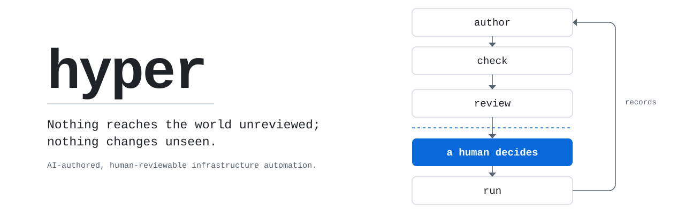
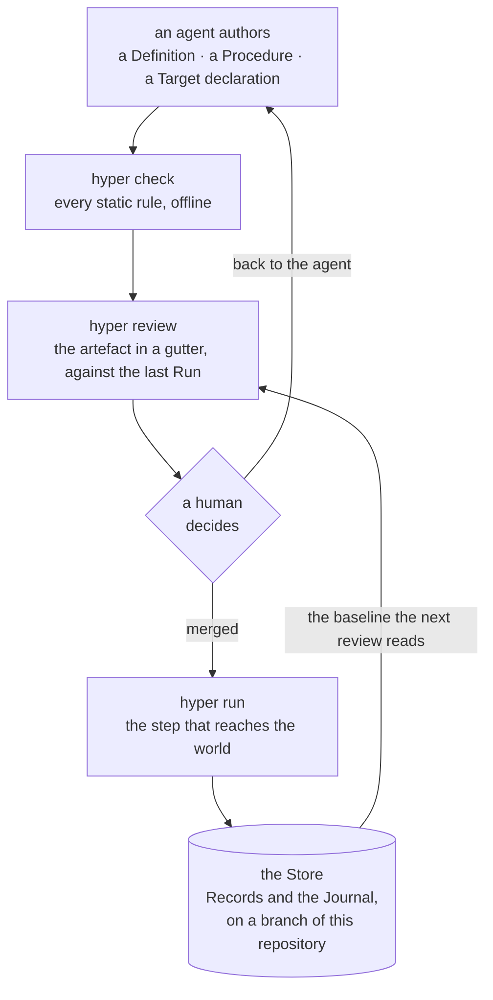
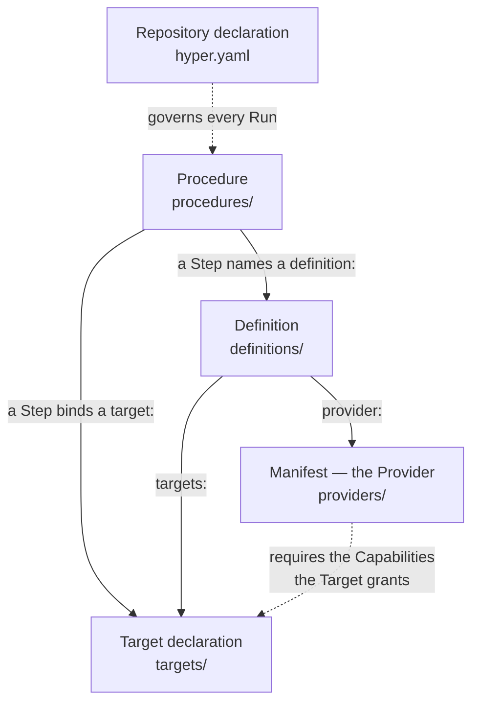
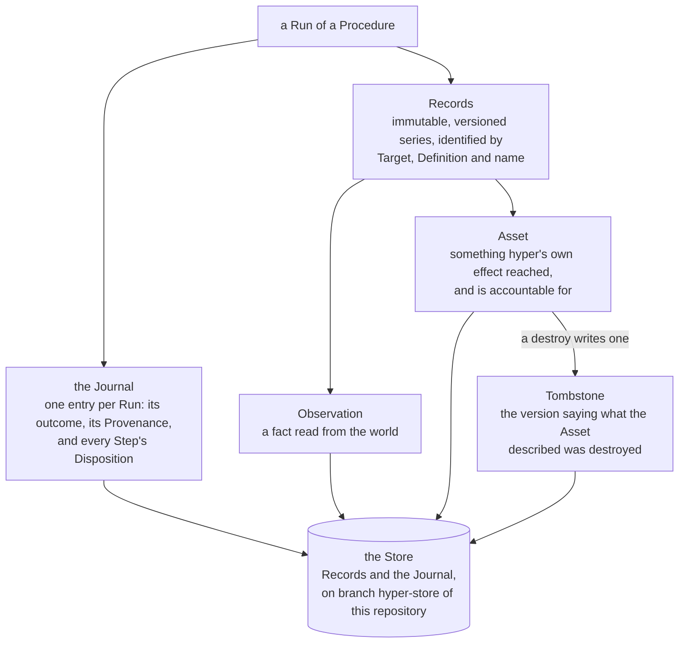
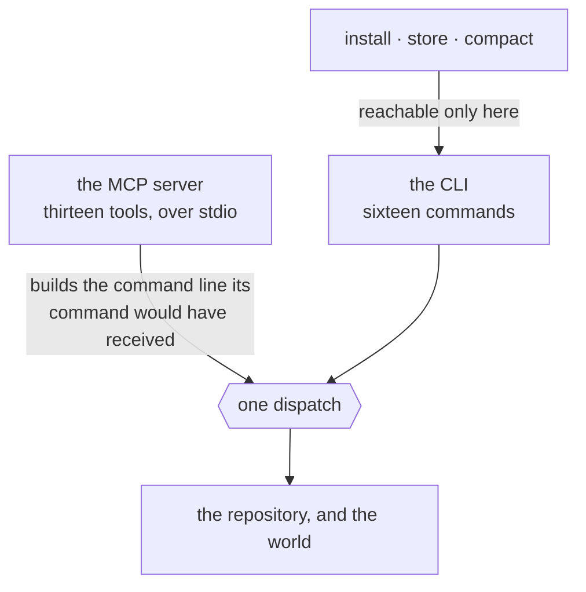

<picture>
  <source media="(prefers-color-scheme: dark)" srcset="docs/images/hero-dark.svg">
  
</picture>

# hyper

[](LICENSE)
[](go.mod)

> **Nothing reaches the world unreviewed; nothing changes unseen.**

An agent writes the artefact; you verify it offline before anything runs, and read exactly
what changed after — including what the agent changed about the artefact.

`hyper` is a tool for AI-authored, human-reviewable infrastructure automation. Its spine is
procedural rather than desired-state: a **Provider** knows how to talk to a kind of system and
exposes **Operations**, a **Definition** is a named, authority-scoped use of one, a
**Procedure** sequences **Steps**, and every invocation acts against a **Target** and produces
**Records**. A Provider is a Manifest — data, never code — so reviewing the artefact is
reviewing the whole of what will run, and every effect it describes is performed by `hyper`
itself from a closed set of Capabilities that only `hyper` defines.

The two clauses cover each other's blind spot, and [§0](docs/spec/01-what-hyper-is.md) is
where that is argued. Neither is accountability alone: one acts on what has not happened yet
and knows nothing about the world; the other accounts for what has happened and stops
nothing.

**What it will not do** is as short a list and as deliberate: no plan, no query language, no
daemon, no telemetry, no team features, and it never updates itself. That is
[below](#what-hyper-deliberately-is-not), with a reason attached to each.

## The loop



<sub>Renders [§0](docs/spec/01-what-hyper-is.md), and the sequence
[ADR-0093](docs/adr/0093-orientation-is-a-handshake-field-and-hyper-writes-no-file-to-carry-it.md)
states. The gate is the loop's, not the tool's: there is no per-Run approval
([§13](docs/spec/14-non-goals-and-honest-limits.md)) and nothing in `hyper` withholds a Run from
an unreviewed tree. What it makes certain is that the change was legible before anyone merged
it — who may make it stick is who may merge.</sub>

Everything above the gate is free to watch. `check` and a review reach nothing outside the
repository, with no credential and no infrastructure — so the half of the thesis that says
*nothing reaches the world unreviewed* costs a clone and nothing else.

## What it looks like

That is the hero above, and here it is in full. An agent widened a `destroy` Step's Bound from
3 to 5 in a Procedure that retires preview environments. `check` reports nothing, and it is right not
to: a Bound is declared, so `bound-missing` does not apply, and whether an Expansion exceeds
one is not decidable from the artefacts at all. The edit is legal. It is not invisible.

```
$ hyper review procedures/retire-preview-envs.yaml

  PROCEDURE         │  procedures/retire-preview-envs.yaml     a91f0c2 → working tree
                    │  03:00 UTC every Monday · ≈4.3 runs/month · last ran 41 days ago
  ──────────────────┼──────────────────────────────────────────────────────────────
  envelope ✓        │   targets: [local, staging]

  DESTROY  staging  │     - id: retire
                    │       definition: hetzner-staging
                    │       operation: delete_server
                    │       over:
                    │         assets:
                    │           - field: labels.role
                    │             equals: preview
                    │           - field: created_at
                    │             older_than: 14d
                    │ ~     bound: 5

  FLAGS   index into the gutter above — no flag states anything the gutter does not
  DESTROY    line 24  step retire  delete_server, bound 5
  WIDENED    line 34  step retire  bound 3 → 5 since a91f0c2
  ENVELOPE   line 3   ok           no step reaches a target outside [local, staging]
```

`WIDENED` is the review surface reporting that an agent widened a `destroy` Bound — before
anything ran, against no infrastructure, beside the line that made the claim. Who may make the
edit stick is who may merge it, and there is no second authority axis inside the tool.

This is [§0](docs/spec/01-what-hyper-is.md)'s worked example, abridged there and here to the
Step the agent touched. Its `hetzner-staging` Definition is illustrative — the Provider that
ships in the binary is `shell`, and the quickstart below runs against that one.

## The five artefacts



<sub>Renders [§2](docs/spec/03-the-model.md) and [§3](docs/spec/04-the-authoring-format.md).
Every artefact lives at a fixed, `hyper`-owned path and carries a `kind:` that must agree with
its directory; `hyper.yaml` is the one exception, agreeing with its filename instead.</sub>

The edges are the diagram's job; what each one carries is short enough to say:

- **Manifest** — the whole of a Provider: its schemas, its Operations and the Kind each
  declares, and the Capabilities it requires. Data, never code.
- **Target declaration** — the reviewed half of a Target: which Kinds it accepts, which
  Capabilities it grants, which endpoint it names. It holds no credentials, which is why every
  static check runs without them.
- **Definition** — a named, authority-scoped use of one Provider: the Kinds it claims and the
  Targets it may bind. It carries no argument values; those belong to the Step.
- **Procedure** — an ordered list of Steps, and the full set of Targets it and everything it
  invokes may touch — authored rather than derived, so a reviewer sees the envelope without
  tracing every nested invocation.
- **Repository declaration** — which version of `hyper` may act here, and how long Records are
  kept. It admits only facts that govern every Run and belong to no other artefact.

These five are the whole of what a Run can reach the world through, and they are the whole of
what there is to read. There is nothing behind a Manifest to fetch, build or isolate — which
is why reviewing it is enough, and why `install` moves data rather than code.

## Quickstart

The sequence below runs, against the built-in `shell` Provider, on your own machine.

**1. Build a stamped binary.** `hyper` learns its own version from the linker, and a build that
omits the flag reports `unknown` and Refuses the version-pin gate on every repository it
touches. The stamp is not optional — see [`docs/build/releasing.md`](docs/build/releasing.md).

```bash
mkdir -p ~/bin   # anywhere on your PATH
go build -ldflags "-X github.com/TheLoomLabs/hyper/internal/version.Version=1.4.0" \
  -o ~/bin/hyper ./cmd/hyper
```

**2. Make a repository.** The Store is a branch of it, so there has to be one.

```bash
mkdir demo && cd demo && git init -b main
mkdir targets definitions procedures
```

**3. Write four artefacts.** The Repository declaration, a Target, a Definition, a Procedure —
the fifth artefact `check` counts is the built-in `shell` Manifest, which ships inside the
binary.

`hyper.yaml` — which version of `hyper` may act here, and how long Records are kept:

```yaml
kind: repository-declaration
version: 1.4.0
digest: sha256:0000000000000000000000000000000000000000000000000000000000000000
retention: 90d
```

`targets/local.yaml` — this machine, and what it grants:

```yaml
kind: target-declaration
target: local
class: local
kinds: [read, mutate]
capabilities: [shell]
```

`definitions/host-ops.yaml` — a named, authority-scoped use of the Provider:

```yaml
kind: definition
definition: host-ops
provider: shell
kinds: [read]
targets: [local]
```

`procedures/say-hello.yaml` — the Steps:

```yaml
kind: procedure
procedure: say-hello
targets: [local]
steps:
  - id: greet
    definition: host-ops
    operation: read
    target: local
    args:
      command: [echo, hello from hyper]
```

**4. Check them.** Every static rule, offline, against no credential.

```console
$ hyper check
checked 5 artefacts: no problems found
```

**5. Read the review.** This is the surface the thesis's first clause is made of: the artefact
in a gutter, the authority assembled from `definitions/` and `targets/`, and a `FLAGS` index
that states nothing the gutter does not.

```console
$ hyper review say-hello
  PROCEDURE            │  procedures/say-hello.yaml               no baseline — no Store
  ─────────────────────┼────────────────────────────────────────────────────────────────
                       │ kind: procedure
                       │ procedure: say-hello
  envelope ✓           │ targets: [local]
                       │ steps:
  read  opaque  local  │   - id: greet
                       │     definition: host-ops
                       │     operation: read
                       │     target: local
                       │     args:
                       │       command: [echo, hello from hyper]

  AUTHORITY   assembled from definitions/ and targets/
  DEFINITION  TARGET  DEFINITION KINDS  TARGET KINDS  EFFECTIVE  DESTROY OPS
  host-ops    local   read              read mutate   r          —

  FLAGS   index into the gutter above — no flag states anything the gutter does not
  OPAQUE    line 5  step greet  read reaches an effect hyper cannot describe
  ENVELOPE  line 3  ok          no step reaches a target outside [local]
```

**6. Create the Store, and commit.** `store init` is a human's act — no MCP tool can perform
it. The commit is not ceremony: a Run's Provenance records `repo_revision`, so a Run against a
tree with no commit has nothing to record and fails.

```bash
hyper store init
git add -A && git commit -m artefacts
```

**7. Run it, and read the record back.**

```console
$ hyper run say-hello
run 01a043df-521e-7a0a-b723-05eaa2bb0588
step 1/1 greet
STEP  ID     KIND  DISPOSITION  RECORDS
1     greet  read  ran          1

completed · exit 0 · run 01a043df-521e-7a0a-b723-05eaa2bb0588

$ hyper runs
RUN             STARTED                   TRIGGER      OUTCOME    CONTESTED  PROCEDURE  TARGETS  HYPER
01a043df-521e…  2026-08-27T15:38:24.158Z  you@machine  completed             say-hello  local    1.4.0

$ hyper records
TARGET  DEFINITION  RECORD                       ORDINAL  RUN             STEP  KIND         TOMBSTONE  ORPHANED  SECRETS  HYPER
local   host-ops    ["echo","hello from hyper"]  1        01a043df-521e…  1     observation                                1.4.0
```

### Three things that will catch you, and why each is a rule

- **A bare `go build` reports `unknown`, and fifteen of the sixteen commands Refuse.**
  `version-pin-mismatch`, exit `77`. The repository pins a version and the gate compares it for
  exact equality against what the binary was stamped with — `hyper` never hashes itself
  ([§11](docs/spec/12-distribution-and-version-pinning.md),
  [ADR-0020](docs/adr/0020-the-hyper-version-is-pinned-by-the-repository.md)). `project` is the
  sixteenth and stands outside the gate, for being the pin's only writer — it Refuses
  `release-artefact-absent` instead, which is the next section. `go install` and a flagless
  `go build` are both unstamped builds.
- **A Run needs a commit.** Provenance is the record of which code produced something, and
  `repo_revision` is one of its members; a `HEAD` resolving to no commit leaves it nothing to
  write, and the Run fails rather than inventing one.
- **A Target's `hosts:` and its `http` Capability go together or not at all.** `hosts:`
  present where `capabilities:` does not grant `http`, *or absent where it does*, is
  `target-inconsistent` ([§4](docs/spec/05-static-verification.md)) — one file, two adjacent
  keys, disagreeing with each other. Correct, and surprising the first time, which is why the
  Target above carries `capabilities: [shell]` and no `hosts:` at all.

### One step here is a workaround, and it is the `digest:`

The documented first act on a new repository is `hyper project`, which writes the version pin,
freezes the digest of the released artefact beside it
([§11](docs/spec/12-distribution-and-version-pinning.md)), and leaves an `AGENTS.md` where the
repository has none. It cannot succeed today, because no release of `hyper` has been
published:

```console
$ hyper project
refused: release-artefact-absent
  https://github.com/TheLoomLabs/hyper/releases/download/v1.4.0/checksums.txt answered 404 — publish a release for 1.4.0, or install a released hyper
```

So the quickstart writes `hyper.yaml` by hand, with a placeholder digest. That placeholder is
inert for everything above — the gate compares the *version* and nothing local ever reads the
digest — and it is **not** inert in a generated workflow, where the digest is the line a runner
checks fetched bytes against. `hyper project` on this repository would happily write a
workflow that verifies against sixty-four zeros.

Once `v1.4.0` is cut ([`docs/build/releasing.md`](docs/build/releasing.md)), the first step
becomes `hyper project`, the hand-written pin goes away, and the `AGENTS.md` comes with it.

## What a Run leaves behind



<sub>Renders [§7](docs/spec/08-the-record.md). The Journal is the only place a Refusal is
recorded, since a Refusal writes no Record.</sub>

The Store being **a branch of your own repository** is the fact people disbelieve. It is an
orphan branch named `hyper-store`, fixed rather than chosen — no setting, no flag — written by
every environment that runs. It is `hyper`'s account of the world rather than part of it, so it
is never a Target and reaching it costs no Capability.

A Comparison reads one Run against the previous Run of the same Procedure, split by which actor
did the changing: the Assets `hyper` changed, the Observations the world changed, and the code
that changed between the two. That third table is what the repository buys — an agent widening
a `destroy` Bound between two Runs is a change of the same class as a server going quiet.

## The two surfaces



<sub>Renders [§9](docs/spec/10-surfaces.md). The three commands that carry *no tool* are the
fact about the shape: an agent may read the record and add to it, and may not create it, prune
it, or bring anything new into the repository.</sub>

One core, two ways in. [§9](docs/spec/10-surfaces.md) fixes that *ergonomics is the whole of
the difference between them*: an MCP tool builds the command line its command would have
received and hands it to the same dispatch, so there is no second place for a guardrail to be
skipped or a Refusal to be reworded.

**Sixteen commands**, flat, one noun group, no aliases and no hidden commands:

| | |
| --- | --- |
| Discovery | `providers` · `provider` · `operation` |
| The repository | `targets` |
| Authoring | `check` · `review` |
| Execution | `run` · `probe` |
| Inspection | `runs` · `show` · `changes` · `records` |
| Lifecycle | `install` · `project` · `store` · `compact` |

Three more stand outside the tree, because none of them reads a repository: `version`,
`completions <shell>`, and `mcp`.

`hyper` with no arguments writes that table — the six groups, the sixteen names with their
positionals, the three outside the tree, and the three configuration flags below — on
stderr, exiting `2`. A word that names no command writes where that list is. There is no
`help` command and no `--help`: neither is among the sixteen, and the list is printed rather
than hidden behind one. That is
[ADR-0094](docs/adr/0094-the-argument-less-invocation-writes-the-tree-and-there-is-no-help.md),
and the reasoning is that the defect was a message saying nothing, not a missing command.

**Thirteen MCP tools**, over stdio, each named for the command it carries:

`providers` · `provider` · `operation` · `targets` · `check` · `review` · `run` · `probe` ·
`runs` · `run_show` · `changes` · `records` · `project`

`run_show` is the one name that differs from its command — a client holds every server's tools
in one flat namespace, where a bare `show` names nothing.

They are the sixteen less `install`, `store` and `compact`, and one line puts all three on the
far side of the boundary: *an agent may read the record and add to it, and may not create it,
prune it, or bring anything new into the repository.* `install` is the single point at which
third-party data enters the repository; `store` creates the record; `compact` is the one
command that would let an agent prune the account it is itself held to.

```json
{
  "mcpServers": {
    "hyper": {
      "command": "hyper",
      "args": ["mcp"],
      "env": { "HYPER_REPO_DIR": "/path/to/your/repo" }
    }
  }
}
```

`hyper mcp` takes no arguments — no `--repo-dir`, no transport flag, no port. The server dies
with its client and offers no asynchronous handle, so it owns the author→validate→observe loop
and short effectful Runs; long unattended work is a Cadence on an executor.

### That config block is the whole of the setup

**The handshake orients the agent.** MCP's `initialize` result carries an `instructions` field,
and `hyper` fills it: what `hyper` is, the five artefacts and where each lives, the
author → `check` → `review` → *hand it to a human* → `run` loop, the three commands that are
the human's and why, that a Refusal retried unchanged refuses identically, and one worked
example of all five artefacts against an HTTP Provider that checks clean. There is nothing to
paste and nothing to read first.

**`hyper project` writes the same text to `AGENTS.md`** where your repository has none, and
never touches one that already stands. A client decides when it surfaces `instructions` — one
harness carries them only when the model searches for tools — and a file in the repository has
no such contingency: every harness reads it up front, whether or not a server is configured.
One text, two channels, because two would disagree the first time either was edited. That is
[ADR-0093](docs/adr/0093-orientation-is-a-handshake-field-and-hyper-writes-no-file-to-carry-it.md)
as [ADR-0095](docs/adr/0095-project-writes-the-orientation-to-agents-md-and-the-handshake-is-not-the-only-channel.md)
amends it.

No artefact is scaffolded. The worked example is a fenced block in a Markdown file — it teaches
the format, grants nothing, and is counted by no `check`.

## What `hyper` deliberately is not

These are decisions, and [§13](docs/spec/14-non-goals-and-honest-limits.md) records each with
its reason. There is **no desired state and no plan** — nothing anywhere renders a proposed
change before it happens, and a Comparison is retrospective by construction
([ADR-0010](docs/adr/0010-hyper-has-no-plan.md)). There is **no query language**
([ADR-0013](docs/adr/0013-hyper-has-no-query-language.md)), **no configuration file** beyond
the reviewed Repository declaration
([ADR-0014](docs/adr/0014-hyper-has-no-configuration-files.md)), **no telemetry** of any kind —
no exporter, no metrics, no trace context, no logging framework
([ADR-0016](docs/adr/0016-hyper-has-no-telemetry.md)) — and **no daemon**: nothing listens on a
port and nothing outlives the invocation that started it. There is **no ad-hoc invocation**:
every Run is a Run of a Procedure, a Probe reaches `local` and `read` alone and is not a Run
([ADR-0009](docs/adr/0009-a-probe-is-not-a-run.md)), and a one-off act against a credentialled
Target is an artefact you have not written yet. There are **no team features** — no accounts,
no roles, no per-Run approval — because who may change what `hyper` does is who may merge a
change to the reviewed artefacts, and a second authority axis inside the tool would be a way
past a Refusal that no artefact records. And `hyper` **never updates itself**
([ADR-0019](docs/adr/0019-hyper-never-updates-itself.md)).

Half the people who would bounce off `hyper` should bounce off it here, rather than three
weeks in. That is what this section is for.

## Where the real documentation is

- [`CONTEXT.md`](CONTEXT.md) — the vocabulary. Every term above is defined there, with the
  synonyms it deliberately avoids.
- [`docs/spec/`](docs/spec/) — the specification, in fourteen sections. It is the authority:
  where the code and the spec disagree, the spec is right.
- [`docs/adr/`](docs/adr/) — ninety-odd records of why, including the options that lost.
- [`docs/build/milestones.md`](docs/build/milestones.md) — the build sequence, and the only
  place it is written down.

**Together they are about 270k tokens, and no session reads them whole.** Do not point a tool
at `docs/spec/` in one pass; it does not fit, and the sections are layers where any one change
is a slice through all of them. `docs/spec/README.md` states which file carries which section.

## Contributing, security, licence

[`CONTRIBUTING.md`](CONTRIBUTING.md) · [`SECURITY.md`](SECURITY.md) ·
[Apache-2.0](LICENSE), copyright TheLoomLabs.
