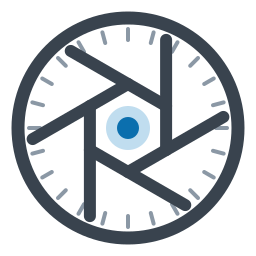
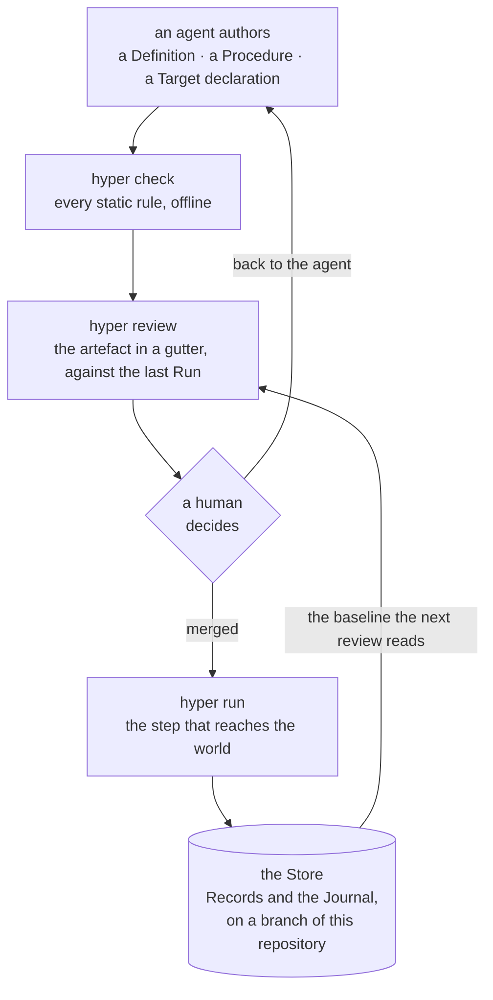

<div align="center">

<picture><source media="(prefers-color-scheme: dark)" srcset="docs/images/logo.svg"></picture>

# hyper

[](.github/workflows/suite.yml)
[](https://github.com/TheLoomLabs/hyper/releases)
[](LICENSE)
[](go.mod)

</div>

`hyper` is a command-line tool for infrastructure automation that an AI agent writes and a human
reviews. The agent authors small YAML artefacts; you verify them offline with `hyper check`, read
the change with `hyper review`, and merge before anything runs. Every Run writes a record to a
branch of your own repository, so the next review can show both what the world changed and what
the agent changed.

**Status: alpha.** The current release is `0.0.4-alpha` and there is one built-in Provider,
`shell`. The format, the CLI, the record and the review surface are specified in full in
[`docs/spec/`](docs/spec/). The spec is the authority: where the code disagrees with it, the spec
is right.

## The loop



The gate here is your merge process, not the tool. There is no per-Run approval
([§13](docs/spec/14-non-goals-and-honest-limits.md)), and nothing in `hyper` withholds a Run from
an unreviewed tree. What it gives you is that the change was legible before anyone merged it.
Whoever may merge is whoever may make a change stick.

`check` and `review` reach nothing outside the repository. They need no credentials and no
infrastructure, so the review half of the loop costs a clone and nothing else.

## What a review looks like

An agent widened a `destroy` Step's Bound from 3 to 5 in a Procedure that retires preview
environments. `check` passes, correctly: a Bound is declared, so `bound-missing` does not apply,
and whether an Expansion will exceed a Bound cannot be decided from the artefacts at all. The
edit is legal, and `review` shows it anyway.

```
$ hyper review procedures/retire-preview-envs.yaml

  PROCEDURE         │  procedures/retire-preview-envs.yaml     a91f0c2 → working tree
                    │  03:00 UTC every Monday · ≈4.3 runs/month · last ran 41 days ago
  ──────────────────┼──────────────────────────────────────────────────────────────
  envelope ✓        │   targets: [local, staging]

  DESTROY  staging  │     - id: retire
                    │       definition: hetzner-staging
                    │       operation: delete_server
                    │       over:
                    │         assets:
                    │           - field: labels.role
                    │             equals: preview
                    │           - field: created_at
                    │             older_than: 14d
                    │ ~     bound: 5

  FLAGS   index into the gutter above — no flag states anything the gutter does not
  DESTROY    line 24  step retire  delete_server, bound 5
  WIDENED    line 34  step retire  bound 3 → 5 since a91f0c2
  ENVELOPE   line 3   ok           no step reaches a target outside [local, staging]
```

`WIDENED` reports the widened Bound before anything ran, against no infrastructure, beside the
line that made the claim.

This is the worked example from [§0](docs/spec/01-what-hyper-is.md), shortened to the Step the
agent touched. Its `hetzner-staging` Definition is illustrative. The Provider that ships in the
binary is `shell`, and that is what the quickstart below uses.

## Install

One binary on your `PATH`. No installer, no daemon, no post-install step, and it never updates
itself ([ADR-0019](docs/adr/0019-hyper-never-updates-itself.md)).

```bash
VERSION=0.0.4-alpha
PLATFORM=x86_64-linux   # or aarch64-linux, x86_64-darwin, aarch64-darwin
BASE=https://github.com/TheLoomLabs/hyper/releases/download/v$VERSION

curl -fLO $BASE/hyper-$VERSION-$PLATFORM.tar.gz
tar -xzf hyper-$VERSION-$PLATFORM.tar.gz
install -m 755 hyper ~/bin/hyper   # anywhere on your PATH
hyper version
```

Or from source, with Go 1.25 or newer:

```bash
go install github.com/TheLoomLabs/hyper/cmd/hyper@v0.0.4-alpha
```

[`docs/install.md`](docs/install.md) covers verifying the download against `checksums.txt`,
installing `v0.0.1-alpha`, building from a clone, and what to do when a command refuses at exit
`77` over the version it read.

## Quickstart

Runs against the built-in `shell` Provider on your own machine. You write three files and `hyper`
writes the fourth. There is no `init` and no generator, because a Definition is the sort of thing
an agent writes and you review; writing them once is the fastest way to see how small the format
is and what `review` does with it.

**1. Make a repository and pin it.** The Store is a branch of a repository, so there has to be
one. `hyper project` writes the version pin and leaves an `AGENTS.md` where you have none.

```console
$ mkdir demo && cd demo && git init -b main
$ mkdir targets definitions procedures

$ hyper project
no Procedure declares a Cadence, and no generated workflow stands

$ cat hyper.yaml
kind: repository-declaration
version: 0.0.4-alpha
digest: sha256:…
```

That message is a report, not a failure: nothing here declares a `cadence:`, so there is no
workflow to project. There is no `retention:` either, deliberately. A repository that has not
stated a policy has not agreed to lose anything, and `project` will not write one for you.

This is the only step that touches the network. `project` fetches `checksums.txt` from the
release tag matching its own version, reads the line for this platform's archive, and freezes
that digest into `hyper.yaml`. A release tag is a mutable pointer and its assets can be replaced
after publication; a digest in a reviewed file cannot. Everything below is offline.

**2. Write three artefacts.**

`targets/local.yaml`, this machine and what it grants:

```yaml
kind: target-declaration
target: local
class: local
kinds: [read, mutate]
capabilities: [shell]
```

`definitions/host-ops.yaml`, a named and authority-scoped use of the Provider:

```yaml
kind: definition
definition: host-ops
provider: shell
kinds: [read]
targets: [local]
```

`procedures/say-hello.yaml`, the Steps:

```yaml
kind: procedure
procedure: say-hello
targets: [local]
steps:
  - id: greet
    definition: host-ops
    operation: read
    target: local
    args:
      command: [echo, hello from hyper]
```

**3. Check them.** Every static rule, offline, against no credential. The five are your three
files, the Repository declaration `project` wrote, and the built-in `shell` Manifest.

```console
$ hyper check
checked 5 artefacts: no problems found
```

**4. Read the review.** The artefact in a gutter, the authority assembled from `definitions/` and
`targets/`, and a `FLAGS` index.

```console
$ hyper review say-hello
  PROCEDURE            │  procedures/say-hello.yaml               no baseline — no Store
  ─────────────────────┼────────────────────────────────────────────────────────────────
                       │ kind: procedure
                       │ procedure: say-hello
  envelope ✓           │ targets: [local]
                       │ steps:
  read  opaque  local  │   - id: greet
                       │     definition: host-ops
                       │     operation: read
                       │     target: local
                       │     args:
                       │       command: [echo, hello from hyper]

  AUTHORITY   assembled from definitions/ and targets/
  DEFINITION  TARGET  DEFINITION KINDS  TARGET KINDS  EFFECTIVE  DESTROY OPS
  host-ops    local   read              read mutate   r          —

  FLAGS   index into the gutter above — no flag states anything the gutter does not
  OPAQUE    line 5  step greet  read reaches an effect hyper cannot describe
  ENVELOPE  line 3  ok          no step reaches a target outside [local]
```

**5. Create the Store and commit.** `store init` is a human's act and no MCP tool can perform it.
The commit matters because a Run's Provenance records `repo_revision`; a tree with no commit
gives it nothing to record, and the Run fails rather than inventing one.

```bash
hyper store init
git add -A && git commit -m artefacts
```

**6. Run it, and read the record back.**

```console
$ hyper run say-hello
run 01a043df-521e-7a0a-b723-05eaa2bb0588
step 1/1 greet
STEP  ID     KIND  DISPOSITION  RECORDS
1     greet  read  ran          1

completed · exit 0 · run 01a043df-521e-7a0a-b723-05eaa2bb0588

$ hyper runs
the record is the hyper-store branch of this repository — never checked out, and it travels with a clone

RUN             STARTED                   TRIGGER      OUTCOME    REHEARSAL  CONTESTED  PROCEDURE  TARGETS  HYPER
01a043df-521e…  2026-08-27T15:38:24.158Z  you@machine  completed                        say-hello  local    0.0.4-alpha
```

Neither listing reads a directory. The record is an orphan branch, `hyper-store`, written with
git plumbing and never checked out, so `ls` and `git status` show nothing of it, `git log
hyper-store` reads it, and `git push` sends it wherever the code goes
([ADR-0006](docs/adr/0006-the-record-travels-in-the-repository.md)).

Steps 1 and 2 happen once. After that an agent writes the artefacts and you stay in *author →
check → review → merge → run → changes*. Two things catch most people in the first hour:

- **A Run needs a commit**, for the reason in step 5.
- **A Target's `hosts:` and its `http` Capability go together or not at all.** `hosts:` present
  without `http` in `capabilities:`, or absent with it, is `target-inconsistent`
  ([§4](docs/spec/05-static-verification.md)). That is why the Target above carries
  `capabilities: [shell]` and no `hosts:`.
- **Order matters.** Until `hyper.yaml` carries a pin, every command that reads the repository
  refuses with `version-pin-absent` and tells you to run `hyper project`.

## The five artefacts

Every artefact lives at a fixed path and carries a `kind:` that must agree with its directory.
`hyper.yaml` is the exception, agreeing with its filename instead.

| Artefact | Where | What it holds |
| --- | --- | --- |
| Manifest | `providers/` | The whole of a Provider: its schemas, its Operations and the Kind each declares, the Capabilities it requires. Data, never code. |
| Target declaration | `targets/` | Which Kinds a Target accepts, which Capabilities it grants, which endpoint it names. |
| Definition | `definitions/` | A named, authority-scoped use of one Provider: the Kinds it claims and the Targets it may bind. No argument values. |
| Procedure | `procedures/` | An ordered list of Steps, plus the full set of Targets it and everything it invokes may touch. |
| Repository declaration | `hyper.yaml` | Which version of `hyper` may act here, and how long Records are kept. |

A Target declaration holds no credentials, which is why every static check runs without them. It
names the *environment variables* they resolve from, so `export HCLOUD_TOKEN=…` works and so does
wrapping the invocation with `op run --`, `direnv`, or `aws-vault exec --`. `hyper` reads
credentials from the process environment and nothing else, which is how it works with every
secret manager without integrating with any of them
([ADR-0007](docs/adr/0007-hyper-never-stores-a-secret.md)).

These five are the whole of what a Run can reach the world through, and the whole of what there
is to read. There is nothing behind a Manifest to fetch, build or isolate. Every effect a
Manifest describes is performed by `hyper` itself, from a closed set of Capabilities that only
`hyper` defines. See [§2](docs/spec/03-the-model.md) and
[§3](docs/spec/04-the-authoring-format.md).

## What a Run leaves behind

A Run writes one Journal entry, with its outcome, its Provenance and every Step's Disposition,
plus a Record for each thing it read or reached. Records are immutable and versioned, identified
by Target, Definition and name: an Observation is a fact read from the world, an Asset is
something `hyper`'s own effect reached and is accountable for, and a Tombstone is the version
saying an Asset was destroyed. All of it lives on the `hyper-store` branch. The Journal is the
only place a Refusal is recorded, since a Refusal writes no Record
([§7](docs/spec/08-the-record.md)).

The branch name is fixed rather than chosen. There is no setting and no flag, and every
environment that runs writes to it. It is `hyper`'s account of the world rather than part of it,
so it is never a Target and reaching it costs no Capability.

`hyper changes` reads one Run against the previous Run of the same Procedure, split by which
actor did the changing: the Assets `hyper` changed, the Observations the world changed, and the
code that changed between the two. That third table is what keeping the record in the repository
buys you. An agent widening a `destroy` Bound between two Runs shows up as a change of the same
class as a server going quiet.

## Using it with an agent

`hyper` has two surfaces: sixteen CLI commands, and an MCP server carrying thirteen of them over
stdio. An MCP tool builds the command line its command would have received and hands it to the
same dispatch, so there is no second place for a guardrail to be skipped or a Refusal to be
reworded ([§9](docs/spec/10-surfaces.md)).

```bash
cd /path/to/your/repo
claude mcp add --scope local hyper -- "$(command -v hyper)" mcp
```

The three commands the server does not carry are `install`, `store` and `compact`. An agent may
read the record and add to it, and may not create it, prune it, or bring anything new into the
repository. Setup for other clients, the four things worth knowing before you wire it up, and how
the agent arrives oriented are in [`docs/mcp.md`](docs/mcp.md).

Ask the agent for the outcome rather than the file. It can `check`, `probe` and `review` its own
work before handing it back:

> Add a Procedure that gets the HTTP status of these three URLs every morning and records them.

> `host-ops` needs to restart the service on staging, not just read it. Widen it.

> The last run refused. Why, and what would fix it?

What it cannot do for you is the review. It wrote the artefact; the gutter, the `AUTHORITY` table
and the `FLAGS` index are for you.

## What hyper deliberately is not

Each of these is a decision with a reason recorded in
[§13](docs/spec/14-non-goals-and-honest-limits.md). Half the people who would bounce off `hyper`
should bounce off it here rather than three weeks in.

- **No desired state and no plan.** Nothing renders a proposed change before it happens, and a
  Comparison is retrospective by construction
  ([ADR-0010](docs/adr/0010-hyper-has-no-plan.md)).
- **No query language** ([ADR-0013](docs/adr/0013-hyper-has-no-query-language.md)) and **no
  configuration file** beyond the reviewed Repository declaration
  ([ADR-0014](docs/adr/0014-hyper-has-no-configuration-files.md)).
- **No telemetry of any kind.** No exporter, no metrics, no trace context, no logging framework
  ([ADR-0016](docs/adr/0016-hyper-has-no-telemetry.md)).
- **No daemon.** Nothing listens on a port and nothing outlives the invocation that started it.
- **No ad-hoc invocation.** Every Run is a Run of a Procedure. A Probe reaches `local` and `read`
  alone and is not a Run ([ADR-0009](docs/adr/0009-a-probe-is-not-a-run.md)), and a one-off act
  against a credentialled Target is an artefact you have not written yet.
- **No team features.** No accounts, no roles, no per-Run approval. Who may change what `hyper`
  does is who may merge a change to the reviewed artefacts, and a second authority axis inside
  the tool would be a way past a Refusal that no artefact records.
- **It never updates itself** ([ADR-0019](docs/adr/0019-hyper-never-updates-itself.md)).

## Documentation

- [`CONTEXT.md`](CONTEXT.md) is the vocabulary, and the answer to every capitalised term above.
  Each is defined in a line, with the synonyms this project avoids. Start here if the nouns are
  the unfamiliar part.
- [`docs/cli.md`](docs/cli.md) is the command reference: all sixteen commands with their flags,
  the three that stand outside the tree, and what each exit code means.
- [`docs/mcp.md`](docs/mcp.md) is the MCP server: the thirteen tools, client setup, and agent
  orientation.
- [`docs/spec/`](docs/spec/) is the specification, in fourteen sections. It is the authority.
- [`docs/adr/`](docs/adr/README.md) is every record of why, including the options that lost.
  [The index](docs/adr/README.md) names all of them and says which dozen to read first.
- [`docs/install.md`](docs/install.md) is the whole install story: checksums, macOS, source
  builds, and the version pin's refusals.
- [`docs/build/releasing.md`](docs/build/releasing.md) is how a release is cut.

## Contributing, security, licence

[`CONTRIBUTING.md`](CONTRIBUTING.md) · [`SECURITY.md`](SECURITY.md) ·
[Apache-2.0](LICENSE), copyright TheLoomLabs.
