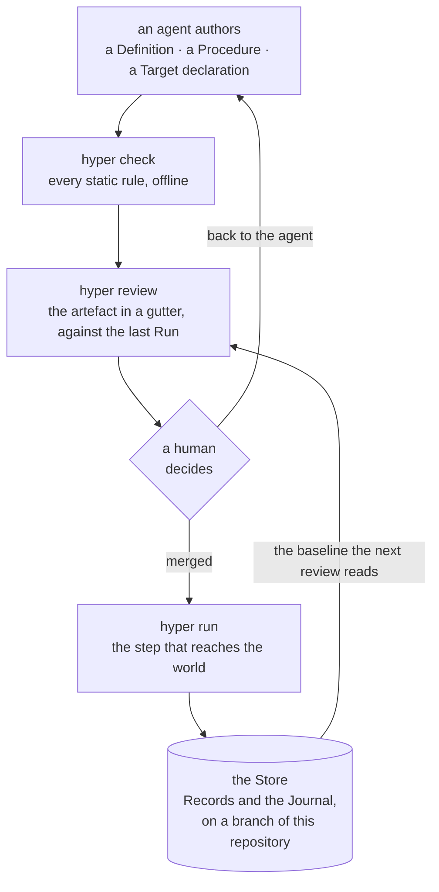
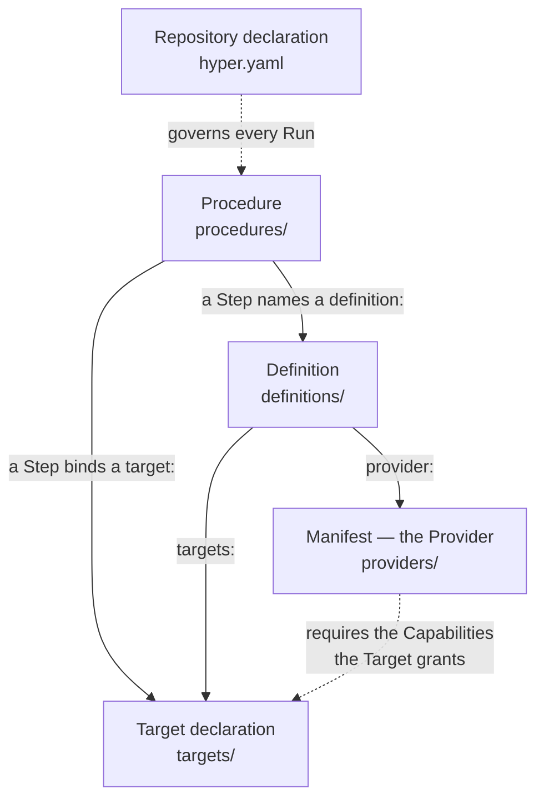
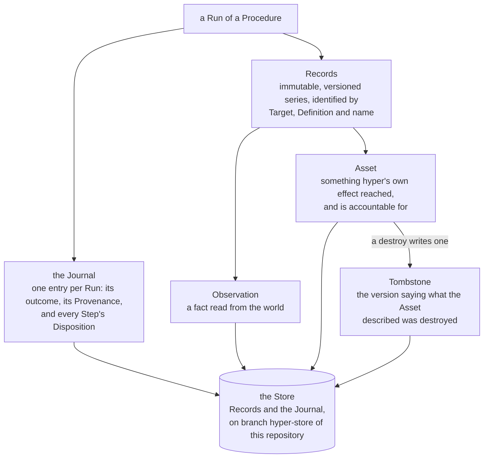
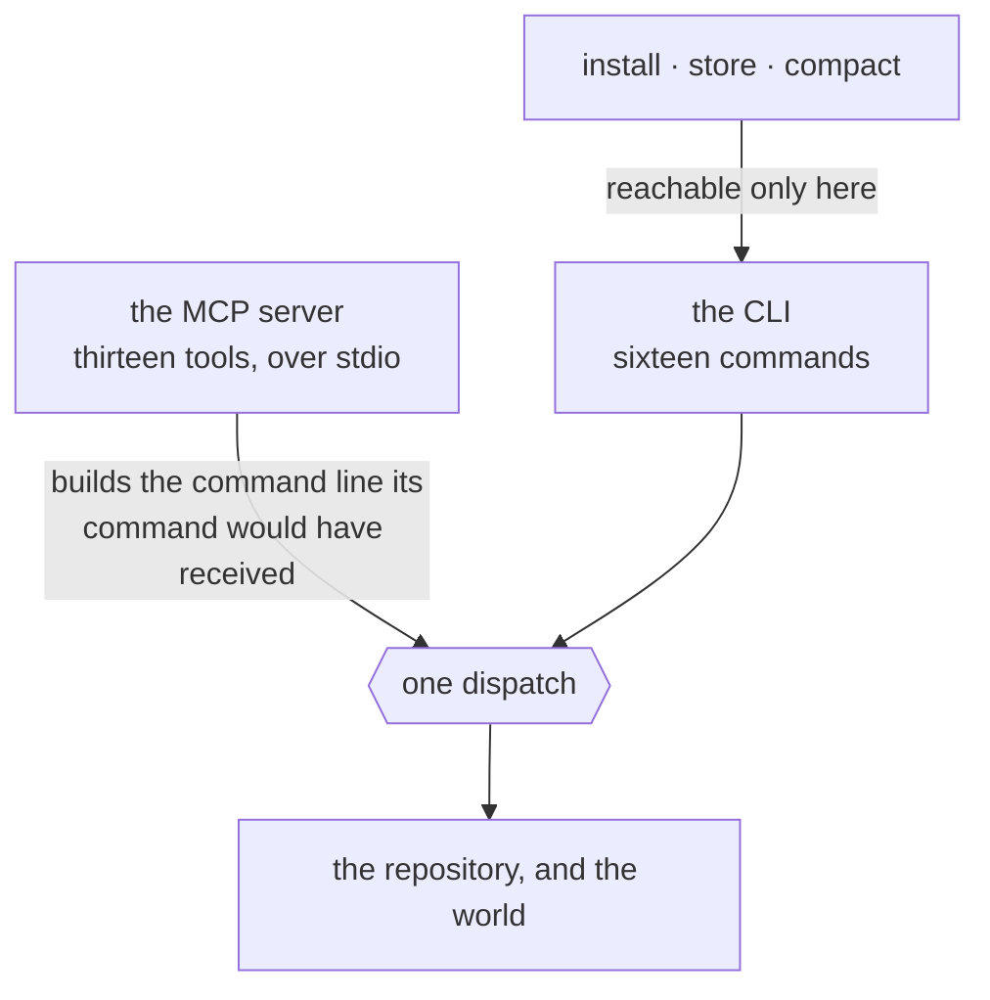

# hyper

[](.github/workflows/suite.yml)
[](https://github.com/TheLoomLabs/hyper/releases)
[](LICENSE)
[](go.mod)

> **Nothing reaches the world unreviewed; nothing changes unseen.**

`hyper` is a tool for AI-authored, human-reviewable infrastructure automation. An agent writes
the artefact; you verify it offline before anything runs, and read exactly what changed after —
including what the agent changed about the artefact.

**Status: alpha.** One release, `0.0.1-alpha`, and one built-in Provider, `shell`. The format,
the CLI, the record and the review surface are specified in full in
[`docs/spec/`](docs/spec/); the spec is the authority, and where the code disagrees with it the
spec is right.

## The loop



<sub>Renders [§0](docs/spec/01-what-hyper-is.md). The gate is the loop's, not the tool's: there
is no per-Run approval ([§13](docs/spec/14-non-goals-and-honest-limits.md)) and nothing in
`hyper` withholds a Run from an unreviewed tree. What it makes certain is that the change was
legible before anyone merged it — who may make it stick is who may merge.</sub>

Everything above the gate is free to watch. `check` and a review reach nothing outside the
repository, with no credential and no infrastructure — so the half of the thesis that says
*nothing reaches the world unreviewed* costs a clone and nothing else.

## What it looks like

An agent widened a `destroy` Step's Bound from 3 to 5 in a Procedure that retires preview
environments. `check` reports nothing, and it is right not to: a Bound is declared, so
`bound-missing` does not apply, and whether an Expansion exceeds one is not decidable from the
artefacts at all. The edit is legal. It is not invisible.

```
$ hyper review procedures/retire-preview-envs.yaml

  PROCEDURE         │  procedures/retire-preview-envs.yaml     a91f0c2 → working tree
                    │  03:00 UTC every Monday · ≈4.3 runs/month · last ran 41 days ago
  ──────────────────┼──────────────────────────────────────────────────────────────
  envelope ✓        │   targets: [local, staging]

  DESTROY  staging  │     - id: retire
                    │       definition: hetzner-staging
                    │       operation: delete_server
                    │       over:
                    │         assets:
                    │           - field: labels.role
                    │             equals: preview
                    │           - field: created_at
                    │             older_than: 14d
                    │ ~     bound: 5

  FLAGS   index into the gutter above — no flag states anything the gutter does not
  DESTROY    line 24  step retire  delete_server, bound 5
  WIDENED    line 34  step retire  bound 3 → 5 since a91f0c2
  ENVELOPE   line 3   ok           no step reaches a target outside [local, staging]
```

`WIDENED` is the review surface reporting that an agent widened a `destroy` Bound — before
anything ran, against no infrastructure, beside the line that made the claim.

This is [§0](docs/spec/01-what-hyper-is.md)'s worked example, abridged to the Step the agent
touched. Its `hetzner-staging` Definition is illustrative; the Provider that ships in the binary
is `shell`, and the quickstart runs against that one.

## Install

One binary, on your `PATH`. No installer, no daemon, no post-install step, and it never updates
itself ([ADR-0019](docs/adr/0019-hyper-never-updates-itself.md)).

```bash
VERSION=0.0.1-alpha
PLATFORM=x86_64-linux   # or aarch64-linux, x86_64-darwin, aarch64-darwin
BASE=https://github.com/TheLoomLabs/hyper/releases/download/v$VERSION

curl -fLO $BASE/hyper-$VERSION-$PLATFORM.tar.gz
tar -xzf hyper-$VERSION-$PLATFORM.tar.gz
install -m 755 hyper ~/bin/hyper   # anywhere on your PATH
hyper version
```

Or from source, with Go 1.25 or newer:

```bash
go install -ldflags "-X github.com/TheLoomLabs/hyper/internal/version.Version=0.0.1-alpha" \
  github.com/TheLoomLabs/hyper/cmd/hyper@v0.0.1-alpha
```

**[`docs/install.md`](docs/install.md) has the rest**, and you want it if any of these apply:
verifying the download against `checksums.txt`; the `-ldflags` above, which is needed only until
there is a release later than `v0.0.1-alpha` to name; a build from a clone; or a command that
Refuses at exit `77` over the version it read.

## Quickstart

With a `hyper` on your `PATH` reporting a released version, the sequence below runs against the
built-in `shell` Provider on your own machine.

**You write three small files by hand, and `hyper` writes the fourth.** The three are not a
tutorial's padding — a Run needs a Target to act on, a Definition to act through, and a
Procedure to sequence. There is no `init`, no template and no generator, because a Definition is
what an **agent** writes and you review. Write them once to see how small the format is and what
`review` does with it, then [wire up the MCP server](#the-two-surfaces) and stop writing them by
hand.

**1. Make a repository, and pin it.** The Store is a branch of it, so there has to be one.
`hyper project` writes the version pin — the version this binary was stamped with, and the digest
published for it — and leaves an `AGENTS.md` where you have none.

```console
$ mkdir demo && cd demo && git init -b main
$ mkdir targets definitions procedures

$ hyper project
no Procedure declares a Cadence, and no generated workflow stands

$ cat hyper.yaml
kind: repository-declaration
version: 0.0.1-alpha
digest: sha256:d9a64425368560358e5931b8de389a36f207d275e935c54a4bd5eb59c3db4096
```

That sentence is the honest answer rather than a failure: nothing here declares a `cadence:`, so
there is no workflow to project. There is no `retention:` either, and that is deliberate — a
repository that has not stated a policy has not agreed to lose anything, and `project` does not
author one on your behalf.

**This is the only step that reaches the network.** `project` fetches one file —
`checksums.txt` from the release tag matching its own version — reads the line naming this
platform's archive, and freezes that digest into `hyper.yaml`. It carries no credential, opens no
Store and writes no Journal entry, because `project` is not a Run. A release tag is a mutable
pointer and its assets can be replaced after publication; a digest in a reviewed file is not, and
freezing it is what turns the one into the other. Everything below is offline.

**2. Write three artefacts.** With the Repository declaration `project` just wrote and the
built-in `shell` Manifest that ships inside the binary, those are the five `check` counts.

`targets/local.yaml` — this machine, and what it grants:

```yaml
kind: target-declaration
target: local
class: local
kinds: [read, mutate]
capabilities: [shell]
```

`definitions/host-ops.yaml` — a named, authority-scoped use of the Provider:

```yaml
kind: definition
definition: host-ops
provider: shell
kinds: [read]
targets: [local]
```

`procedures/say-hello.yaml` — the Steps:

```yaml
kind: procedure
procedure: say-hello
targets: [local]
steps:
  - id: greet
    definition: host-ops
    operation: read
    target: local
    args:
      command: [echo, hello from hyper]
```

**3. Check them.** Every static rule, offline, against no credential.

```console
$ hyper check
checked 5 artefacts: no problems found
```

**4. Read the review.** This is the surface the thesis's first clause is made of: the artefact
in a gutter, the authority assembled from `definitions/` and `targets/`, and a `FLAGS` index
that states nothing the gutter does not.

```console
$ hyper review say-hello
  PROCEDURE            │  procedures/say-hello.yaml               no baseline — no Store
  ─────────────────────┼────────────────────────────────────────────────────────────────
                       │ kind: procedure
                       │ procedure: say-hello
  envelope ✓           │ targets: [local]
                       │ steps:
  read  opaque  local  │   - id: greet
                       │     definition: host-ops
                       │     operation: read
                       │     target: local
                       │     args:
                       │       command: [echo, hello from hyper]

  AUTHORITY   assembled from definitions/ and targets/
  DEFINITION  TARGET  DEFINITION KINDS  TARGET KINDS  EFFECTIVE  DESTROY OPS
  host-ops    local   read              read mutate   r          —

  FLAGS   index into the gutter above — no flag states anything the gutter does not
  OPAQUE    line 5  step greet  read reaches an effect hyper cannot describe
  ENVELOPE  line 3  ok          no step reaches a target outside [local]
```

**5. Create the Store, and commit.** `store init` is a human's act — no MCP tool can perform
it. The commit is not ceremony: a Run's Provenance records `repo_revision`, so a Run against a
tree with no commit has nothing to record and fails.

```bash
hyper store init
git add -A && git commit -m artefacts
```

**6. Run it, and read the record back.**

```console
$ hyper run say-hello
run 01a043df-521e-7a0a-b723-05eaa2bb0588
step 1/1 greet
STEP  ID     KIND  DISPOSITION  RECORDS
1     greet  read  ran          1

completed · exit 0 · run 01a043df-521e-7a0a-b723-05eaa2bb0588

$ hyper runs
the record is the hyper-store branch of this repository — never checked out, and it travels with a clone

RUN             STARTED                   TRIGGER      OUTCOME    CONTESTED  PROCEDURE  TARGETS  HYPER
01a043df-521e…  2026-08-27T15:38:24.158Z  you@machine  completed             say-hello  local    0.0.1-alpha

$ hyper records
the record is the hyper-store branch of this repository — never checked out, and it travels with a clone

TARGET  DEFINITION  RECORD                       ORDINAL  RUN             STEP  REHEARSAL  KIND         TOMBSTONE  ORPHANED  SECRETS  HYPER
local   host-ops    ["echo","hello from hyper"]  1        01a043df-521e…  1                observation                                0.0.1-alpha
```

Neither listing is reading a directory. The record is an orphan branch, `hyper-store`, written
with git plumbing and never checked out — so `ls` and `git status` show nothing of it, `git log
hyper-store` reads it, and `git push` sends it wherever the code goes
([ADR-0006](docs/adr/0006-the-record-travels-in-the-repository.md),
[ADR-0113](docs/adr/0113-a-listing-over-the-record-says-where-the-record-is.md)).

**Steps 1 and 2 happen once**; in a repository you mean to keep, an agent writes the artefacts
and you stay in *author → `check` → `review` → merge → `run` → `changes`*. `hyper` on its own
prints the whole command tree, so what is available is never more than one invocation away. And
**the order above is not a suggestion**: until `hyper.yaml` carries a pin, every command that
reads the repository Refuses `version-pin-absent` and tells you to run `hyper project`.

Two rules catch most people in the first hour:

- **A Run needs a commit.** Provenance is the record of which code produced something, and
  `repo_revision` is one of its members; a `HEAD` resolving to no commit leaves it nothing to
  write, and the Run fails rather than inventing one.
- **A Target's `hosts:` and its `http` Capability go together or not at all.** `hosts:`
  present where `capabilities:` does not grant `http`, *or absent where it does*, is
  `target-inconsistent` ([§4](docs/spec/05-static-verification.md)) — one file, two adjacent
  keys, disagreeing with each other. Which is why the Target above carries `capabilities:
  [shell]` and no `hosts:` at all.

The third is the version pin, and [`docs/install.md`](docs/install.md#when-a-command-refuses-over-the-version)
holds it with the rest of the version story.

## The five artefacts



<sub>Renders [§2](docs/spec/03-the-model.md) and [§3](docs/spec/04-the-authoring-format.md).
Every artefact lives at a fixed, `hyper`-owned path and carries a `kind:` that must agree with
its directory; `hyper.yaml` is the one exception, agreeing with its filename instead.</sub>

- **Manifest** — the whole of a Provider: its schemas, its Operations and the Kind each
  declares, and the Capabilities it requires. Data, never code.
- **Target declaration** — the reviewed half of a Target: which Kinds it accepts, which
  Capabilities it grants, which endpoint it names. It holds no credentials, which is why every
  static check runs without them.
- **Definition** — a named, authority-scoped use of one Provider: the Kinds it claims and the
  Targets it may bind. It carries no argument values; those belong to the Step.
- **Procedure** — an ordered list of Steps, and the full set of Targets it and everything it
  invokes may touch — authored rather than derived, so a reviewer sees the envelope without
  tracing every nested invocation.
- **Repository declaration** — which version of `hyper` may act here, and how long Records are
  kept. It admits only facts that govern every Run and belong to no other artefact.

These five are the whole of what a Run can reach the world through, and they are the whole of
what there is to read. There is nothing behind a Manifest to fetch, build or isolate — which is
why reviewing it is enough, and why `install` moves data rather than code. Every effect a
Manifest describes is performed by `hyper` itself, from a closed set of Capabilities that only
`hyper` defines.

## What a Run leaves behind



<sub>Renders [§7](docs/spec/08-the-record.md). The Journal is the only place a Refusal is
recorded, since a Refusal writes no Record.</sub>

The Store being **a branch of your own repository** is the fact people disbelieve. It is an
orphan branch named `hyper-store`, fixed rather than chosen — no setting, no flag — written by
every environment that runs. It is `hyper`'s account of the world rather than part of it, so it
is never a Target and reaching it costs no Capability.

A Comparison reads one Run against the previous Run of the same Procedure, split by which actor
did the changing: the Assets `hyper` changed, the Observations the world changed, and the code
that changed between the two. That third table is what the repository buys — an agent widening
a `destroy` Bound between two Runs is a change of the same class as a server going quiet.

## The two surfaces



<sub>Renders [§9](docs/spec/10-surfaces.md).</sub>

One core, two ways in. [§9](docs/spec/10-surfaces.md) fixes that *ergonomics is the whole of the
difference between them*: an MCP tool builds the command line its command would have received
and hands it to the same dispatch, so there is no second place for a guardrail to be skipped or
a Refusal to be reworded.

**Sixteen commands**, flat, one noun group, no aliases and no hidden commands:

| | |
| --- | --- |
| Discovery | `providers` · `provider` · `operation` |
| The repository | `targets` |
| Authoring | `check` · `review` |
| Execution | `run` · `probe` |
| Inspection | `runs` · `show` · `changes` · `records` |
| Lifecycle | `install` · `project` · `store` · `compact` |

Three more stand outside the tree, because none of them reads a repository: `version`,
`completions <shell>`, and `mcp`.

**Thirteen MCP tools**, over stdio, each named for the command it carries — the sixteen less
`install`, `store` and `compact`:

`providers` · `provider` · `operation` · `targets` · `check` · `review` · `run` · `probe` ·
`runs` · `run_show` · `changes` · `records` · `project`

One line puts those three on the far side of the boundary: *an agent may read the record and add
to it, and may not create it, prune it, or bring anything new into the repository.* `install` is
the single point at which third-party data enters the repository; `store` creates the record;
`compact` is the one command that would let an agent prune the account it is itself held to.
`run_show` is the one name that differs from its command — a client holds every server's tools in
one flat namespace, where a bare `show` names nothing.

```json
{
  "mcpServers": {
    "hyper": {
      "command": "hyper",
      "args": ["mcp"],
      "env": { "HYPER_REPO_DIR": "/path/to/your/repo" }
    }
  }
}
```

`hyper mcp` takes no arguments — no `--repo-dir`, no transport flag, no port. The server dies
with its client and offers no asynchronous handle, so it owns the author→validate→observe loop
and short effectful Runs; long unattended work is a Cadence on an executor.

**That config block is the whole of the setup.** MCP's `initialize` result carries an
`instructions` field, and `hyper` fills it: what `hyper` is, the five artefacts and where each
lives, the loop, the three commands that are the human's and why, that a Refusal retried
unchanged refuses identically, and one worked example of all five artefacts that checks clean.
`hyper project` writes the same text to `AGENTS.md` where your repository has none, and never
touches one that already stands — a client decides when it surfaces `instructions`, and a file in
the repository has no such contingency. One text, two channels, because two would disagree the
first time either was edited
([ADR-0093](docs/adr/0093-orientation-is-a-handshake-field-and-hyper-writes-no-file-to-carry-it.md),
[ADR-0095](docs/adr/0095-project-writes-the-orientation-to-agents-md-and-the-handshake-is-not-the-only-channel.md)).

So ask the agent for the outcome rather than the file. It can `check`, `probe` and `review` its
own work before handing it back:

> Add a Procedure that gets the HTTP status of these three URLs every morning and records them.

> `host-ops` needs to restart the service on staging, not just read it. Widen it.

> The last run refused. Why, and what would fix it?

What it cannot do for you is the review. It wrote the artefact; the gutter, the `AUTHORITY` table
and the `FLAGS` index are for you — and who may make an edit stick is who may merge it.

## What `hyper` deliberately is not

These are decisions, and [§13](docs/spec/14-non-goals-and-honest-limits.md) records each with its
reason. There is **no desired state and no plan** — nothing anywhere renders a proposed change
before it happens, and a Comparison is retrospective by construction
([ADR-0010](docs/adr/0010-hyper-has-no-plan.md)). There is **no query language**
([ADR-0013](docs/adr/0013-hyper-has-no-query-language.md)), **no configuration file** beyond the
reviewed Repository declaration
([ADR-0014](docs/adr/0014-hyper-has-no-configuration-files.md)), **no telemetry** of any kind —
no exporter, no metrics, no trace context, no logging framework
([ADR-0016](docs/adr/0016-hyper-has-no-telemetry.md)) — and **no daemon**: nothing listens on a
port and nothing outlives the invocation that started it. There is **no ad-hoc invocation**:
every Run is a Run of a Procedure, a Probe reaches `local` and `read` alone and is not a Run
([ADR-0009](docs/adr/0009-a-probe-is-not-a-run.md)), and a one-off act against a credentialled
Target is an artefact you have not written yet. There are **no team features** — no accounts, no
roles, no per-Run approval — because who may change what `hyper` does is who may merge a change
to the reviewed artefacts, and a second authority axis inside the tool would be a way past a
Refusal that no artefact records. And `hyper` **never updates itself**
([ADR-0019](docs/adr/0019-hyper-never-updates-itself.md)).

Half the people who would bounce off `hyper` should bounce off it here, rather than three weeks
in. That is what this section is for.

## Where the real documentation is

- [`CONTEXT.md`](CONTEXT.md) — **the vocabulary, and the answer to every capitalised term
  above.** Each one is defined in a line, with the synonyms this project deliberately avoids.
  Start here if the nouns are the part that is unfamiliar.
- [`docs/spec/`](docs/spec/) — the specification, in fourteen sections. It is the authority:
  where the code and the spec disagree, the spec is right.
- [`docs/adr/`](docs/adr/README.md) — **every record of why, including the options that lost.**
  [The index](docs/adr/README.md) names all of them, says which dozen to read first, and is held
  complete by a case rather than by a number somebody remembered to update.
- [`docs/install.md`](docs/install.md) — the whole install story: checksums, macOS, source
  builds, and the version pin's Refusals.
- [`docs/build/releasing.md`](docs/build/releasing.md) — how a release is cut, for anyone
  cutting one.

## Contributing, security, licence

[`CONTRIBUTING.md`](CONTRIBUTING.md) · [`SECURITY.md`](SECURITY.md) ·
[Apache-2.0](LICENSE), copyright TheLoomLabs.
