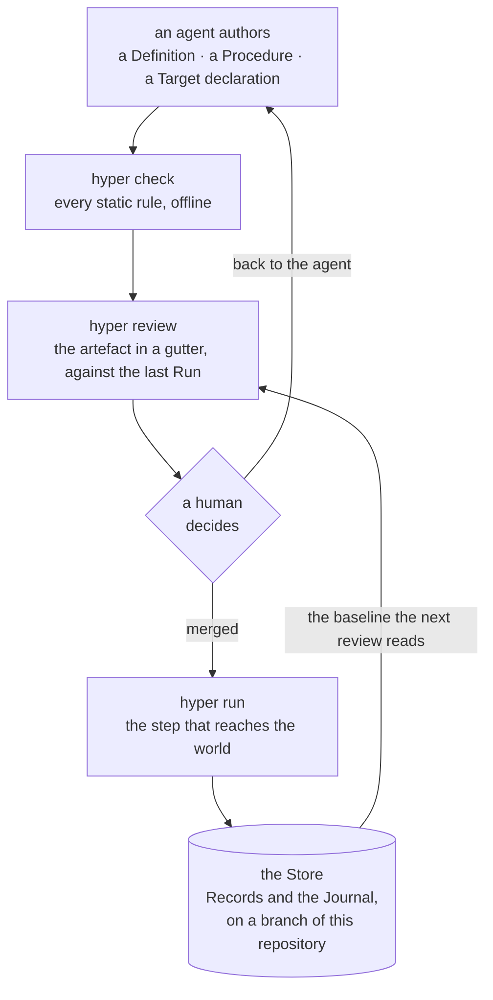
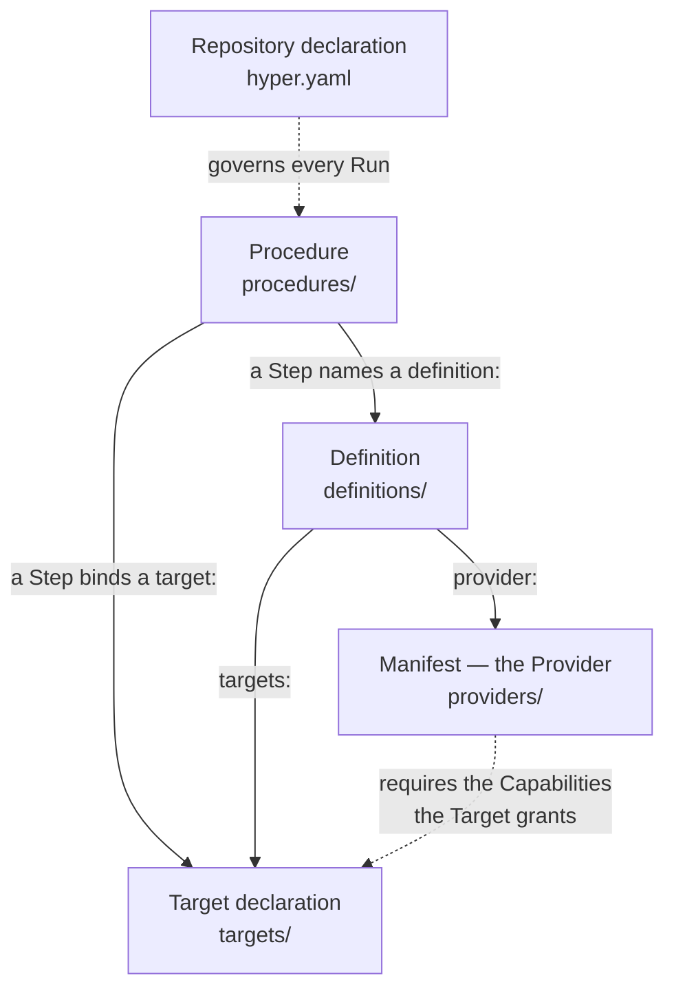
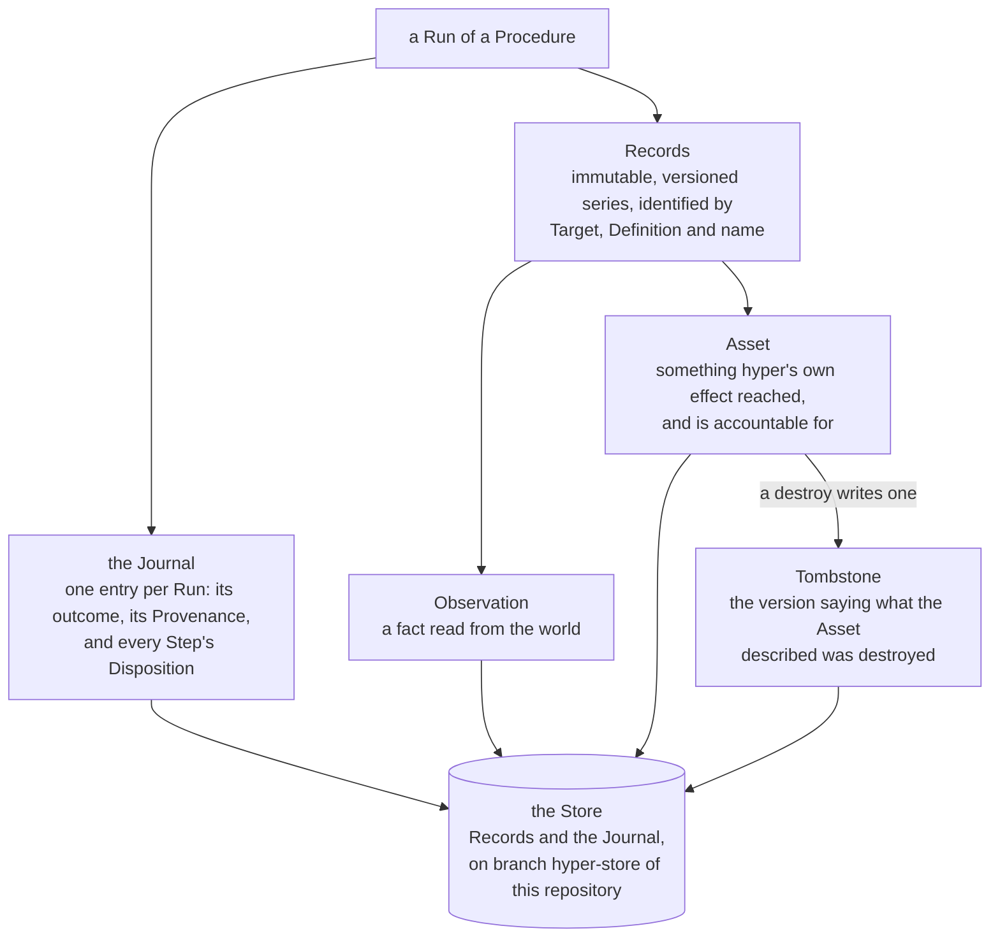
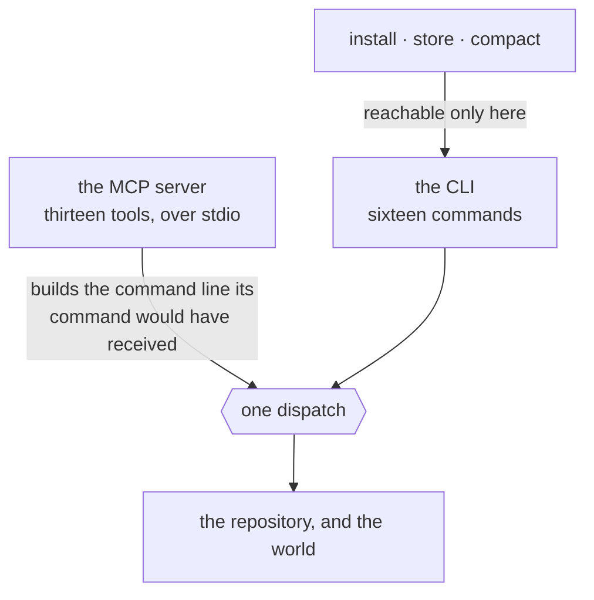

# hyper

[](LICENSE)
[](go.mod)

> **Nothing reaches the world unreviewed; nothing changes unseen.**

An agent writes the artefact; you verify it offline before anything runs, and read exactly
what changed after — including what the agent changed about the artefact.

`hyper` is a tool for AI-authored, human-reviewable infrastructure automation. Its spine is
procedural rather than desired-state: a **Provider** knows how to talk to a kind of system and
exposes **Operations**, a **Definition** is a named, authority-scoped use of one, a
**Procedure** sequences **Steps**, and every invocation acts against a **Target** and produces
**Records**. A Provider is a Manifest — data, never code — so reviewing the artefact is
reviewing the whole of what will run, and every effect it describes is performed by `hyper`
itself from a closed set of Capabilities that only `hyper` defines. Every capitalised term
here has a one-line answer in the [glossary](#glossary).

The two clauses cover each other's blind spot, and [§0](docs/spec/01-what-hyper-is.md) is
where that is argued. Neither is accountability alone: one acts on what has not happened yet
and knows nothing about the world; the other accounts for what has happened and stops
nothing.

**What it will not do** is as short a list and as deliberate: no plan, no query language, no
daemon, no telemetry, no team features, and it never updates itself. That is
[below](#what-hyper-deliberately-is-not), with a reason attached to each.

## Contents

- [The loop](#the-loop)
- [What it looks like](#what-it-looks-like)
- [The five artefacts](#the-five-artefacts)
- [Install](#install)
- [Quickstart](#quickstart)
- [Your first repository](#your-first-repository)
  - [Telling the agent what to do](#telling-the-agent-what-to-do)
- [What a Run leaves behind](#what-a-run-leaves-behind)
- [The two surfaces](#the-two-surfaces)
- [Glossary](#glossary)
- [What `hyper` deliberately is not](#what-hyper-deliberately-is-not)
- [Where the real documentation is](#where-the-real-documentation-is)
- [Contributing, security, licence](#contributing-security-licence)

## The loop



<sub>Renders [§0](docs/spec/01-what-hyper-is.md), and the sequence
[ADR-0093](docs/adr/0093-orientation-is-a-handshake-field-and-hyper-writes-no-file-to-carry-it.md)
states. The gate is the loop's, not the tool's: there is no per-Run approval
([§13](docs/spec/14-non-goals-and-honest-limits.md)) and nothing in `hyper` withholds a Run from
an unreviewed tree. What it makes certain is that the change was legible before anyone merged
it — who may make it stick is who may merge.</sub>

Everything above the gate is free to watch. `check` and a review reach nothing outside the
repository, with no credential and no infrastructure — so the half of the thesis that says
*nothing reaches the world unreviewed* costs a clone and nothing else.

## What it looks like

That is the hero above, and here it is in full. An agent widened a `destroy` Step's Bound from
3 to 5 in a Procedure that retires preview environments. `check` reports nothing, and it is right not
to: a Bound is declared, so `bound-missing` does not apply, and whether an Expansion exceeds
one is not decidable from the artefacts at all. The edit is legal. It is not invisible.

```
$ hyper review procedures/retire-preview-envs.yaml

  PROCEDURE         │  procedures/retire-preview-envs.yaml     a91f0c2 → working tree
                    │  03:00 UTC every Monday · ≈4.3 runs/month · last ran 41 days ago
  ──────────────────┼──────────────────────────────────────────────────────────────
  envelope ✓        │   targets: [local, staging]

  DESTROY  staging  │     - id: retire
                    │       definition: hetzner-staging
                    │       operation: delete_server
                    │       over:
                    │         assets:
                    │           - field: labels.role
                    │             equals: preview
                    │           - field: created_at
                    │             older_than: 14d
                    │ ~     bound: 5

  FLAGS   index into the gutter above — no flag states anything the gutter does not
  DESTROY    line 24  step retire  delete_server, bound 5
  WIDENED    line 34  step retire  bound 3 → 5 since a91f0c2
  ENVELOPE   line 3   ok           no step reaches a target outside [local, staging]
```

`WIDENED` is the review surface reporting that an agent widened a `destroy` Bound — before
anything ran, against no infrastructure, beside the line that made the claim. Who may make the
edit stick is who may merge it, and there is no second authority axis inside the tool.

This is [§0](docs/spec/01-what-hyper-is.md)'s worked example, abridged there and here to the
Step the agent touched. Its `hetzner-staging` Definition is illustrative — the Provider that
ships in the binary is `shell`, and the quickstart below runs against that one.

## The five artefacts



<sub>Renders [§2](docs/spec/03-the-model.md) and [§3](docs/spec/04-the-authoring-format.md).
Every artefact lives at a fixed, `hyper`-owned path and carries a `kind:` that must agree with
its directory; `hyper.yaml` is the one exception, agreeing with its filename instead.</sub>

The edges are the diagram's job; what each one carries is short enough to say:

- **Manifest** — the whole of a Provider: its schemas, its Operations and the Kind each
  declares, and the Capabilities it requires. Data, never code.
- **Target declaration** — the reviewed half of a Target: which Kinds it accepts, which
  Capabilities it grants, which endpoint it names. It holds no credentials, which is why every
  static check runs without them.
- **Definition** — a named, authority-scoped use of one Provider: the Kinds it claims and the
  Targets it may bind. It carries no argument values; those belong to the Step.
- **Procedure** — an ordered list of Steps, and the full set of Targets it and everything it
  invokes may touch — authored rather than derived, so a reviewer sees the envelope without
  tracing every nested invocation.
- **Repository declaration** — which version of `hyper` may act here, and how long Records are
  kept. It admits only facts that govern every Run and belong to no other artefact.

These five are the whole of what a Run can reach the world through, and they are the whole of
what there is to read. There is nothing behind a Manifest to fetch, build or isolate — which
is why reviewing it is enough, and why `install` moves data rather than code.

## Install

`hyper` is one binary and installs by being put on your `PATH`. It has no installer, no
daemon and no post-install step, and it never updates itself
([ADR-0019](docs/adr/0019-hyper-never-updates-itself.md)).

### From a release

Releases publish four archives — **`x86_64-linux`, `aarch64-linux`, `x86_64-darwin` and
`aarch64-darwin`**. There is no Windows build. `checksums.txt` is `sha256sum`'s own output,
and checking against it by hand is the same act `hyper project` performs when it freezes the
digest into your Repository declaration.

```bash
VERSION=0.0.1-alpha
PLATFORM=x86_64-linux   # or aarch64-linux, x86_64-darwin, aarch64-darwin
BASE=https://github.com/TheLoomLabs/hyper/releases/download/v$VERSION

curl -fLO $BASE/hyper-$VERSION-$PLATFORM.tar.gz
curl -fLO $BASE/checksums.txt
grep " hyper-$VERSION-$PLATFORM.tar.gz$" checksums.txt | sha256sum -c -
# where there is no sha256sum:                         | shasum -a 256 -c -

tar -xzf hyper-$VERSION-$PLATFORM.tar.gz
install -m 755 hyper ~/bin/hyper   # anywhere on your PATH
hyper version
```

**Neither `curl` carries a credential and neither needs one.** The release is public, and it is the
same read `hyper project` makes when it freezes the digest into your Repository declaration
([ADR-0131](docs/adr/0131-project-wrote-a-digest-for-the-first-time-and-the-network-contributed-one-scalar.md)).

**The two macOS archives are notarised by nobody**, and `spctl --assess` rejects both. Each was
downloaded and run on a machine matching it — every archive above was, which is
[ADR-0133](docs/adr/0133-three-archives-nobody-had-run-carried-and-the-release-stamps-three-of-four-dirty.md)
— but only ever fetched with `curl`, which sets no quarantine attribute. What a **browser** download
does has not been measured ([#262](https://github.com/TheLoomLabs/hyper/issues/262)).

### From source

Go 1.25 or newer, which `go.mod` carries. `go install` is fine — it takes `-ldflags` like any
other build:

```bash
go install -ldflags "-X github.com/TheLoomLabs/hyper/internal/version.Version=0.0.1-alpha" \
  github.com/TheLoomLabs/hyper/cmd/hyper@v0.0.1-alpha
```

From a clone, the same stamp against a path:

```bash
mkdir -p ~/bin   # anywhere on your PATH
go build -ldflags "-X github.com/TheLoomLabs/hyper/internal/version.Version=0.0.1-alpha" \
  -o ~/bin/hyper ./cmd/hyper
```

**It is the flag that matters, not the command.** `hyper` learns its own version from the
linker, so a bare `go install` or `go build` stamps nothing, reports `unknown`, and Refuses the
version-pin gate on every repository it touches — the first of [three things that will catch
you](#three-things-that-will-catch-you-and-why-each-is-a-rule).
[`docs/build/releasing.md`](docs/build/releasing.md) owns the invocation.

## Quickstart

With a stamped `hyper` on your `PATH`, the sequence below runs against the built-in `shell`
Provider on your own machine.

**You are about to write three small files by hand, and `hyper` writes the fourth.**
`hyper.yaml` is `hyper project`'s — [step 1 below](#step-1-is-the-only-one-that-reaches-the-network).
The other three `hyper` scaffolds on purpose: there is no `init`, no template and no generator,
because a Definition is what an **agent** writes and you review. Three is the floor rather than a
tutorial's padding — a Run needs a Target to act on, a Definition to act through, and a
Procedure to sequence. Write them once to see how small the format is and what `review` does
with it, then [wire up the MCP server](#the-two-surfaces) and stop writing them by hand.

**1. Make a repository, and pin it.** The Store is a branch of it, so there has to be one.
`hyper project` writes the version pin — the version this binary was stamped with, and the digest
published for it — and leaves an `AGENTS.md` where you have none.

```console
$ mkdir demo && cd demo && git init -b main
$ mkdir targets definitions procedures

$ hyper project
no Procedure declares a Cadence, and no generated workflow stands

$ cat hyper.yaml
kind: repository-declaration
version: 0.0.1-alpha
digest: sha256:d9a64425368560358e5931b8de389a36f207d275e935c54a4bd5eb59c3db4096
```

That sentence is the honest answer rather than a failure: nothing here declares a `cadence:`, so
there is no workflow to project. There is no `retention:` either, and that is deliberate — a
repository that has not stated a policy has not agreed to lose anything, and `project` does not
author one on your behalf. Add one when you mean it.

**2. Write three artefacts.** A Target, a Definition, a Procedure. With the Repository declaration
`project` just wrote and the built-in `shell` Manifest that ships inside the binary, those are the
five `check` counts.

`targets/local.yaml` — this machine, and what it grants:

```yaml
kind: target-declaration
target: local
class: local
kinds: [read, mutate]
capabilities: [shell]
```

`definitions/host-ops.yaml` — a named, authority-scoped use of the Provider:

```yaml
kind: definition
definition: host-ops
provider: shell
kinds: [read]
targets: [local]
```

`procedures/say-hello.yaml` — the Steps:

```yaml
kind: procedure
procedure: say-hello
targets: [local]
steps:
  - id: greet
    definition: host-ops
    operation: read
    target: local
    args:
      command: [echo, hello from hyper]
```

**3. Check them.** Every static rule, offline, against no credential.

```console
$ hyper check
checked 5 artefacts: no problems found
```

**4. Read the review.** This is the surface the thesis's first clause is made of: the artefact
in a gutter, the authority assembled from `definitions/` and `targets/`, and a `FLAGS` index
that states nothing the gutter does not.

```console
$ hyper review say-hello
  PROCEDURE            │  procedures/say-hello.yaml               no baseline — no Store
  ─────────────────────┼────────────────────────────────────────────────────────────────
                       │ kind: procedure
                       │ procedure: say-hello
  envelope ✓           │ targets: [local]
                       │ steps:
  read  opaque  local  │   - id: greet
                       │     definition: host-ops
                       │     operation: read
                       │     target: local
                       │     args:
                       │       command: [echo, hello from hyper]

  AUTHORITY   assembled from definitions/ and targets/
  DEFINITION  TARGET  DEFINITION KINDS  TARGET KINDS  EFFECTIVE  DESTROY OPS
  host-ops    local   read              read mutate   r          —

  FLAGS   index into the gutter above — no flag states anything the gutter does not
  OPAQUE    line 5  step greet  read reaches an effect hyper cannot describe
  ENVELOPE  line 3  ok          no step reaches a target outside [local]
```

**5. Create the Store, and commit.** `store init` is a human's act — no MCP tool can perform
it. The commit is not ceremony: a Run's Provenance records `repo_revision`, so a Run against a
tree with no commit has nothing to record and fails.

```bash
hyper store init
git add -A && git commit -m artefacts
```

**6. Run it, and read the record back.**

```console
$ hyper run say-hello
run 01a043df-521e-7a0a-b723-05eaa2bb0588
step 1/1 greet
STEP  ID     KIND  DISPOSITION  RECORDS
1     greet  read  ran          1

completed · exit 0 · run 01a043df-521e-7a0a-b723-05eaa2bb0588

$ hyper runs
the record is the hyper-store branch of this repository — never checked out, and it travels with a clone

RUN             STARTED                   TRIGGER      OUTCOME    CONTESTED  PROCEDURE  TARGETS  HYPER
01a043df-521e…  2026-08-27T15:38:24.158Z  you@machine  completed             say-hello  local    0.0.1-alpha

$ hyper records
the record is the hyper-store branch of this repository — never checked out, and it travels with a clone

TARGET  DEFINITION  RECORD                       ORDINAL  RUN             STEP  REHEARSAL  KIND         TOMBSTONE  ORPHANED  SECRETS  HYPER
local   host-ops    ["echo","hello from hyper"]  1        01a043df-521e…  1                observation                                0.0.1-alpha
```

Neither listing is reading a directory. The record is an orphan branch, `hyper-store`, written with git
plumbing and never checked out — so `ls` and `git status` show nothing of it, `git log hyper-store` reads
it, and `git push` sends it wherever the code goes
([ADR-0006](docs/adr/0006-the-record-travels-in-the-repository.md),
[ADR-0113](docs/adr/0113-a-listing-over-the-record-says-where-the-record-is.md)).

### Three things that will catch you, and why each is a rule

- **A bare `go build` reports `unknown`, and fifteen of the sixteen commands Refuse.**
  `version-pin-mismatch`, exit `77`. The repository pins a version and the gate compares it for
  exact equality against what the binary was stamped with — `hyper` never hashes itself
  ([§11](docs/spec/12-distribution-and-version-pinning.md),
  [ADR-0020](docs/adr/0020-the-hyper-version-is-pinned-by-the-repository.md)). `project` is the
  sixteenth and stands outside the gate, for being the pin's only writer — it Refuses
  `release-artefact-absent` instead, which is the next section. a flagless `go install` and a flagless
  `go build` are both unstamped builds, and either stamps when given `-ldflags`.
- **A Run needs a commit.** Provenance is the record of which code produced something, and
  `repo_revision` is one of its members; a `HEAD` resolving to no commit leaves it nothing to
  write, and the Run fails rather than inventing one.
- **A Target's `hosts:` and its `http` Capability go together or not at all.** `hosts:`
  present where `capabilities:` does not grant `http`, *or absent where it does*, is
  `target-inconsistent` ([§4](docs/spec/05-static-verification.md)) — one file, two adjacent
  keys, disagreeing with each other. Correct, and surprising the first time, which is why the
  Target above carries `capabilities: [shell]` and no `hosts:` at all.

### Step 1 is the only one that reaches the network

`hyper project` fetches one file — `checksums.txt` from the release tag matching its own version —
reads the line naming `hyper-<version>-x86_64-linux.tar.gz`, and freezes that digest into
`hyper.yaml`. **That one read is the whole of what the pin ever reaches the network for**
([§11](docs/spec/12-distribution-and-version-pinning.md),
[ADR-0020](docs/adr/0020-the-hyper-version-is-pinned-by-the-repository.md)) — it carries no
credential, opens no Store and writes no Journal entry, because `project` is not a Run. Everything
else in this quickstart is offline: `check`, `review` and `store init` by construction, and step 6
because the Procedure above runs `echo` on this machine.

**Why that one fetch is worth a step of its own.** A release tag is a mutable pointer and its
assets can be replaced after publication; a digest in a reviewed file is not. Freezing it is what
turns the one into the other, it happens attended, and it lands in a diff you read — which is also
the whole of the upgrade ritual later on: install a new binary, run `hyper project`, read the diff.

The digest is inert on this machine — the version pin gate compares the *version* and nothing
local ever reads the digest — and it is **not** inert in a generated workflow, where it is the
line a runner checks fetched bytes against before it executes them. That is the reason not to
hand-write one.

If `project` refuses `release-artefact-absent` at exit `77`, the binary you are running is not one
any readable release names — an unstamped `go build` reports `unknown` and there is no
`v-unknown` tag. [Install from a release](#from-a-release), or stamp the build.

## Your first repository

The quickstart is a throwaway. This is the same loop in a repository you mean to keep, and
**the order is not a suggestion** — until `hyper.yaml` carries a pin, every command that reads
the repository Refuses `version-pin-absent` and tells you to run `hyper project`.

| | Run | What it does |
| --- | --- | --- |
| 1 | `hyper project` | Writes `hyper.yaml` — the version pin and the release digest — and an `AGENTS.md` where you have none. **Nothing that reads the repository works before it** — every command in the tree Refuses `version-pin-absent`, and only `version`, `completions` and `mcp` stand outside. |
| 2 | `hyper store init` | Creates the `hyper-store` branch. A human's act: no MCP tool performs it. |
| 3 | *the agent writes artefacts* | A Target declaration, a Definition, a Procedure. See below. |
| 4 | `hyper check` | Every static rule, offline, against no credential. |
| 5 | `hyper review <name>` | The artefact in a gutter, with what changed since the last Run. **This is the step that is yours.** |
| 6 | `git commit`, and merge | A Run's Provenance records `repo_revision`; a tree with no commit has nothing to record and fails. |
| 7 | `hyper run <procedure>` | The first thing here that reaches the world. |
| 8 | `hyper changes` · `hyper records` | What the Run left behind, and what moved since the one before it. |

Steps 1 and 2 happen once. **Steps 3 to 8 are the loop you stay in.** `hyper` on its own prints
the whole command tree, so what is available is never more than one invocation away.

### Telling the agent what to do

Wire the server once — [the config block is below](#the-two-surfaces) — and the agent arrives
oriented. MCP's `initialize` hands it what `hyper` is, the five artefacts and where each lives,
the loop, the three commands that are yours, and a worked example that checks clean. `hyper
project` writes the same text to `AGENTS.md`, which every harness reads whether or not a server
is configured. There is nothing to paste and nothing to explain first.

So ask for the outcome rather than the file. The agent holds thirteen tools and can `check`,
`probe` and `review` its own work before handing it back:

> Add a Procedure that gets the HTTP status of these three URLs every morning and records them.

> `host-ops` needs to restart the service on staging, not just read it. Widen it.

> The last run refused. Why, and what would fix it?

**Three commands are yours alone, and no tool reaches them**: `install`, `store` and `compact`.
An agent may read the record and add to it, and may not create it, prune it, or bring anything
new into the repository.

The fourth thing it cannot do for you is the review. It wrote the artefact; the gutter, the
`AUTHORITY` table and the `FLAGS` index are for you — and who may make an edit stick is who may
merge it.

## What a Run leaves behind



<sub>Renders [§7](docs/spec/08-the-record.md). The Journal is the only place a Refusal is
recorded, since a Refusal writes no Record.</sub>

The Store being **a branch of your own repository** is the fact people disbelieve. It is an
orphan branch named `hyper-store`, fixed rather than chosen — no setting, no flag — written by
every environment that runs. It is `hyper`'s account of the world rather than part of it, so it
is never a Target and reaching it costs no Capability.

A Comparison reads one Run against the previous Run of the same Procedure, split by which actor
did the changing: the Assets `hyper` changed, the Observations the world changed, and the code
that changed between the two. That third table is what the repository buys — an agent widening
a `destroy` Bound between two Runs is a change of the same class as a server going quiet.

## The two surfaces



<sub>Renders [§9](docs/spec/10-surfaces.md). The three commands that carry *no tool* are the
fact about the shape: an agent may read the record and add to it, and may not create it, prune
it, or bring anything new into the repository.</sub>

One core, two ways in. [§9](docs/spec/10-surfaces.md) fixes that *ergonomics is the whole of
the difference between them*: an MCP tool builds the command line its command would have
received and hands it to the same dispatch, so there is no second place for a guardrail to be
skipped or a Refusal to be reworded.

**Sixteen commands**, flat, one noun group, no aliases and no hidden commands:

| | |
| --- | --- |
| Discovery | `providers` · `provider` · `operation` |
| The repository | `targets` |
| Authoring | `check` · `review` |
| Execution | `run` · `probe` |
| Inspection | `runs` · `show` · `changes` · `records` |
| Lifecycle | `install` · `project` · `store` · `compact` |

Three more stand outside the tree, because none of them reads a repository: `version`,
`completions <shell>`, and `mcp`.

`hyper` with no arguments writes that table — the six groups, the sixteen names with their
positionals, the three outside the tree, and the three configuration flags below — on
stderr, exiting `2`. A word that names no command writes where that list is, and a flag a
command does not take writes what that command does take — its own parameters and the three
globals, on one line, `check takes no flags of its own` where it has none. There is no
`help` command and no `--help`: neither is among the sixteen, and the list is printed rather
than hidden behind one. That is
[ADR-0094](docs/adr/0094-the-argument-less-invocation-writes-the-tree-and-there-is-no-help.md)
and [ADR-0098](docs/adr/0098-an-unknown-flag-names-the-flags-that-command-takes.md), and the
reasoning is that the defect was a message saying nothing, not a missing command.

**Thirteen MCP tools**, over stdio, each named for the command it carries:

`providers` · `provider` · `operation` · `targets` · `check` · `review` · `run` · `probe` ·
`runs` · `run_show` · `changes` · `records` · `project`

`run_show` is the one name that differs from its command — a client holds every server's tools
in one flat namespace, where a bare `show` names nothing.

They are the sixteen less `install`, `store` and `compact`, and one line puts all three on the
far side of the boundary: *an agent may read the record and add to it, and may not create it,
prune it, or bring anything new into the repository.* `install` is the single point at which
third-party data enters the repository; `store` creates the record; `compact` is the one
command that would let an agent prune the account it is itself held to.

```json
{
  "mcpServers": {
    "hyper": {
      "command": "hyper",
      "args": ["mcp"],
      "env": { "HYPER_REPO_DIR": "/path/to/your/repo" }
    }
  }
}
```

`hyper mcp` takes no arguments — no `--repo-dir`, no transport flag, no port. The server dies
with its client and offers no asynchronous handle, so it owns the author→validate→observe loop
and short effectful Runs; long unattended work is a Cadence on an executor.

### That config block is the whole of the setup

**The handshake orients the agent.** MCP's `initialize` result carries an `instructions` field,
and `hyper` fills it: what `hyper` is, the five artefacts and where each lives, the
author → `check` → `review` → *hand it to a human* → `run` loop, the three commands that are
the human's and why, that a Refusal retried unchanged refuses identically, and one worked
example of all five artefacts against an HTTP Provider that checks clean. There is nothing to
paste and nothing to read first.

**`hyper project` writes the same text to `AGENTS.md`** where your repository has none, and
never touches one that already stands. A client decides when it surfaces `instructions` — one
harness carries them only when the model searches for tools — and a file in the repository has
no such contingency: every harness reads it up front, whether or not a server is configured.
One text, two channels, because two would disagree the first time either was edited. That is
[ADR-0093](docs/adr/0093-orientation-is-a-handshake-field-and-hyper-writes-no-file-to-carry-it.md)
as [ADR-0095](docs/adr/0095-project-writes-the-orientation-to-agents-md-and-the-handshake-is-not-the-only-channel.md)
amends it.

No artefact is scaffolded. The worked example is a fenced block in a Markdown file — it teaches
the format, grants nothing, and is counted by no `check`.

## Glossary

Every term below is defined in full in [`CONTEXT.md`](CONTEXT.md), which is the authority and
which also lists, for each one, the synonyms this project deliberately avoids. This is the
short version, for the first read.

**What a Provider is made of**

| Term | What it is |
| --- | --- |
| **Provider** | A named capability for talking to one kind of system — its schemas, its Operations, and the Capabilities it requires. It is a Manifest and nothing else. |
| **Manifest** | The whole of a Provider: data rather than code. There is no implementation behind it to review, which is why reviewing it is enough. |
| **Operation** | A single callable a Provider exposes, carrying a declared Kind. |
| **Kind** | An Operation's declared blast radius — `read`, `mutate` or `destroy`. Always declared in the Manifest, never inferred from an Operation's name. |
| **Capability** | One effect `hyper` can perform on a Manifest's behalf, from a closed set only `hyper` defines. A Manifest declares the ones it requires; a Target declaration grants them; an Operation reaches only what both name. |
| **Opaque** | A Capability whose effects `hyper` cannot describe — running a command, say. Orthogonal to Kind, so an Opaque Operation still declares whether it destroys. |
| **Repeatability** | What an Operation does when a Procedure is run again: `repeatable`, `skip-if-recorded`, or run-once. Declared in the Manifest, never inferred. |
| **Extension** | A Provider authored by someone other than `hyper`. Being a Manifest, it contains no code, and the Capabilities reserved to built-ins are never granted to it. |

**What you write** — the five reviewed artefacts

| Term | Where it lives | What it is |
| --- | --- | --- |
| **Repository declaration** | `hyper.yaml` | Which version of `hyper` may act here, and how long Records are kept. |
| **Target declaration** | `targets/` | The reviewed half of a Target: which Kinds it accepts, which Capabilities it grants, which endpoint it names. Holds no credentials, so every static check runs without them. |
| **Definition** | `definitions/` | A named, authority-scoped use of one Provider: the Kinds it claims and the Targets it may bind. Nothing is invoked except through one. |
| **Procedure** | `procedures/` | An ordered set of Steps, declaring the full set of Targets it may touch. |
| **Manifest** | `providers/` | As above — the Provider itself, as data. Built-ins ship inside the binary. |
| **Step** | in a Procedure | One Operation, invoked through one Definition, against one Target. |
| **Bound** | on a Step | The most Records an effectful Step may affect. Mandatory on a `destroy` Step, where an absent Bound means unbounded rather than unchecked. |
| **Cadence** | on a Procedure | Its declared recurrence, as a UTC cron expression. `hyper` projects it into an external executor's clock rather than keeping one of its own, so it is a lower bound on staleness rather than a promise of coverage. |

**The world it acts on**

| Term | What it is |
| --- | --- |
| **Target** | A concrete system an Operation acts on, and the unit of both blast radius and credentials. |
| **Target credentials** | The unreviewed half: the secrets the declaration names as environment variables. They live where your environment already keeps them, never in the repository. |
| **Local** | The Target meaning this machine. Its *name* is reserved, not its file — you author its declaration like any other, and it is what a Probe binds. |
| **Expansion** | The resolution of a Step's selector to the concrete Records it will act on. |

**What a Run leaves behind**

| Term | What it is |
| --- | --- |
| **Run** | A single execution of a Procedure, and the unit against which change is reviewed. |
| **Record** | An immutable, versioned series of what an Operation produced. Every Record is either an Observation or an Asset. |
| **Observation** | A fact read from the world at a point in time. `hyper` is not accountable for what it describes. |
| **Asset** | Something `hyper`'s own effect reached and is therefore accountable for. A thing merely observed is never an Asset. |
| **Tombstone** | The version of an Asset recording that what it described was destroyed, and what its last known state was. |
| **Store** | Where Records and the Journal live: the `hyper-store` branch of your own repository. It is `hyper`'s account of the world rather than part of it, so it is never a Target. |
| **Journal** | The append-only series of Run entries. The only place a Refusal is recorded, since a Refusal writes no Record. |
| **Refusal** | A guardrail declining before any effect reached the world. Distinct from failure, which means the world resisted. |
| **Disposition** | What a Step did in a Run — ran, skipped, refused, never reached, or attempted with the outcome unknown. |
| **Probe** | A `read` Operation against `local` without a Definition, writing no Record and no Journal entry. A lookup rather than a Run. |
| **Rehearsal** | A Run under `--dry-run`. It performs the reads it reaches and *withholds* the first effectful Step rather than simulating it. |
| **Provenance** | The record of which code produced something: the revisions, the digests, and the version of `hyper` that performed it. |
| **Comparison** | One Run read against the previous Run of the same Procedure. Retrospective by construction, so it reports what happened rather than proposing what would. |

## What `hyper` deliberately is not

These are decisions, and [§13](docs/spec/14-non-goals-and-honest-limits.md) records each with
its reason. There is **no desired state and no plan** — nothing anywhere renders a proposed
change before it happens, and a Comparison is retrospective by construction
([ADR-0010](docs/adr/0010-hyper-has-no-plan.md)). There is **no query language**
([ADR-0013](docs/adr/0013-hyper-has-no-query-language.md)), **no configuration file** beyond
the reviewed Repository declaration
([ADR-0014](docs/adr/0014-hyper-has-no-configuration-files.md)), **no telemetry** of any kind —
no exporter, no metrics, no trace context, no logging framework
([ADR-0016](docs/adr/0016-hyper-has-no-telemetry.md)) — and **no daemon**: nothing listens on a
port and nothing outlives the invocation that started it. There is **no ad-hoc invocation**:
every Run is a Run of a Procedure, a Probe reaches `local` and `read` alone and is not a Run
([ADR-0009](docs/adr/0009-a-probe-is-not-a-run.md)), and a one-off act against a credentialled
Target is an artefact you have not written yet. There are **no team features** — no accounts,
no roles, no per-Run approval — because who may change what `hyper` does is who may merge a
change to the reviewed artefacts, and a second authority axis inside the tool would be a way
past a Refusal that no artefact records. And `hyper` **never updates itself**
([ADR-0019](docs/adr/0019-hyper-never-updates-itself.md)).

Half the people who would bounce off `hyper` should bounce off it here, rather than three
weeks in. That is what this section is for.

## Where the real documentation is

- [`CONTEXT.md`](CONTEXT.md) — the vocabulary. Every term above is defined there, with the
  synonyms it deliberately avoids.
- [`docs/spec/`](docs/spec/) — the specification, in fourteen sections. It is the authority:
  where the code and the spec disagree, the spec is right.
- [`docs/adr/`](docs/adr/) — ninety-odd records of why, including the options that lost.

## Contributing, security, licence

[`CONTRIBUTING.md`](CONTRIBUTING.md) · [`SECURITY.md`](SECURITY.md) ·
[Apache-2.0](LICENSE), copyright TheLoomLabs.
